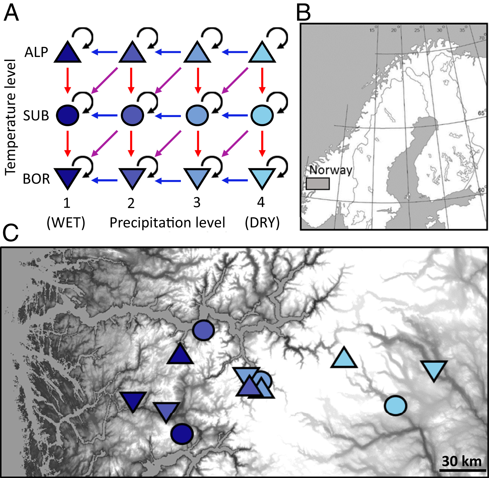
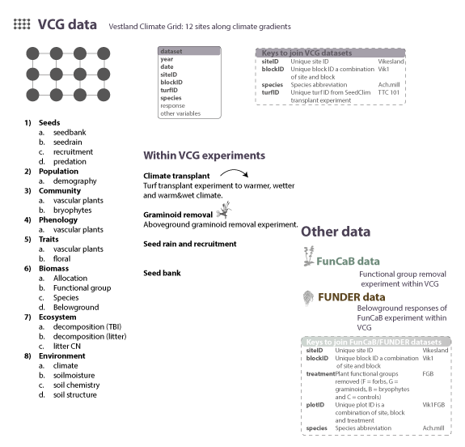

```{r InitialSettings, out.width='100%', include = FALSE}
knitr::opts_chunk$set(
  collapse = TRUE,
  comment = "#>",
  message = FALSE,
  warning = FALSE
)
library("tidyverse")
library("lubridate")
library("readxl")
library("tibble")
library("dataDownloader")
library("vegan")
library("patchwork")
library(kableExtra)


theme_set(theme_bw(base_size = 12))

source("data_dictionary/data_dic.R")

```

This is the GitHub repository for the Vestland Climate Grid (VCG) and the associate data paper: Vandvik et al. (in prep). Ten years of plant community response to climate change - data from whole-community turf-transplant experiments across broad-scale temperature and precipitation gradients in Western Norway.

# INTRODUCTION


# METHODS

## Research sites
Our study is conducted as a replicated distributed experiment across twelve calcareous grassland sites in southern Norway.
Careful site selection ensured that these twelve sites vary systematically in a ‘grid’ of three temperature levels crossed with four precipitation levels. 
Within each site, we measured a range of site-level biotic and abiotic data, and set up three experiments from which we measured a range of environmental and response variables over 12 years. 

```{r grid, echo=FALSE, out.width='70%', fig.cap= "Climate grid"}


```

## Experimental designs 

Within the VCG, we performed a number of experiments.

- Climate transplant experiments
- Graminoid removal experiment
- Seed rain and seedling recruitment experiments
- Seed bank study


# DATA MANAGAEMENT

## Location of data and supporting information

Project meta-information, data documentation, data set overview and metadata for each dataset are in the VCG data paper (in prep).
Also see below.

The raw and clean data are stored and available on [OSF](https://osf.io/npfa9/).

All R code for the analyses from the Norwegian project is on [GitHub](https://github.com/Between-the-Fjords/seedclim-data).


## Download data

To download the clean data from OSF use the dataDownloader package.
This is how to install and load the package.


```{r downloader-function, echo=TRUE, eval=FALSE}
devtools::install_github("Between-the-Fjords/dataDownloader")
library("dataDownloader")
```


Here is an example for how to download the biomass data:

The *node* is a specific code for the VCG OSF repository.
The *file* defines which specific file that needs to be downloaded.
The *path* refers to where the data should be downloaded to in your RStudio project.
And finally the *remote_path* refers to the folder on OSF, where the data is stored.

```{r downloader-biomass, echo=TRUE, eval=FALSE}
get_file(node = "npfa9",
         file = "VCG_clean_functional_group_biomass_2010_2013-2015.csv",
         path = "clean_data",
         remote_path = "6_Biomass_data")
```

For an overview of all available datasets see Table (\@ref(tab:data-sets).


## Naming conventions

| Data or file  | Description of naming convention  |
|:---|:---|
| Data files  | project_experiment_status_response_year.extension; e.g. VCG_clean_biomass_2009-2012.csv  |
| Project  | VCG |
| Experiment  | E.g. Graminoid removal  |
|   |   |
| siteID  | Unique site nmae; e.g. Ulvehaugen (see full list of sites below) |
| blockID  | Unique blockID consisting of first 3 letters of site and block nr; e.g. Ves3 |
| originPlotID  | Unique origin plotID, numeric value; e.g. 271 |
| destinationPlotID  | Unique destination plotID, numeric value; e.g. 211 |
| turfID | Unique turfID containing originPlotID, transplant treatment and destinationPlotID; e.g. 234 TT3 332 |
| TTtreat | Turf transplant treatment including TTC = untouched control, TT1 = local transplant, TT2 warm, TT3 = wet, TT4 warm + wet |
| species  | Vascular plant taxon names follow for Norway Lid & Lid(Lid J & Lid, 2010). First three digits of genus and species; e.g. Vio.bif |
| responses  | response variable, e.g. cover, biomass, decomposition |


### Valid siteID

Here is the list of valid siteIDs in VCG.

| siteID  |
|:---|
| Fauske  |
| Vikesland  |
| Arhelleren  |
| Ovstedalen  |
| Alrust  |
| Hogsete  |
| Rambera  |
| Veskre  |
| Ulvehaugen  |
| Lavisdalen  |
| Gudmedalen  |
| Skjelingahaugen  |

Below is code to clean the site names.
On the left side are the *old names* (e.g. Gud) that you want to replace (change to what fits your data).
And on the right side are *valid names*, which will replace the old names (don't change!).

```{r clean-site, eval=FALSE, echo=TRUE}

# code to clean site names
dat |> 
  mutate(siteID = recode(siteID, 
         'Gud' = "Gudmedalen",
         'Lad' = "Lavisdalen",
         'Ram' = "Rambera",
         'Ulv' = "Ulvehaugen",
         'Skj' = "Skjelingahaugen",
         'Alr' = "Alrust",
         'Arh' = "Arhelleren",
         'Fau' = "Fauske",
         'Hog' = "Hogsete",
         'Ovs' = "Ovstedalen",
         'Vik' = "Vikesland",
         'Ves' = "Veskre"))
```


# DATASETS

Here is an overview over all the datasets.

```{r data-sets, echo=FALSE}
tibble(Variable = c("seedbank", "seedrain", "recruitment", "predation",
                    "demography", 
                    "vascular plants",  "bryophytes", 
                    "vascular plants", 
                    "vascular plants leaf", "vascular plants floral", 
                    "allocation", "functional groups", "species", "belowground biomass and productivity", "graminoid removal",
                    "decomposition (TBI)", "decomposition (litter)", "litter CN", 
                    "climate", "soilmoisture", "soil chemistry", "soil structure"),
       Period = c("2009", "2010", "2009-2012", "2018",
                    "??", 
                    "2009-2019",  "2012-2014", 
                    "2014-2015", 
                    "2012, 2016", "2019", 
                    "2010", "2010, 2013-2015", "2013", "2013-2014", "2011-2018",
                    "2014-2016", "2016-2017", "2016", 
                    "2009-2022", "2010, 2015-2018", "2010", "2019"),
       Level = c("block", "block", "??", "site",
                    "plot", 
                    "plot",  "plot", 
                    "plot", 
                    "site", "site", 
                    "block", "plot/block", "block", "block", "plot",
                    "block", "block", "litter CN", 
                    "site", "plot", "site", "site"),
       File = c("VCG_clean_seedbank.xlsx", "VCG_clean_seedrain.csv", "???", "VCG_clean_seed_predation_2018.csv",
                    "in prep", 
                    "seedcloim.2020.4.15.zip",  "in prep", 
                    "VCG_clean_community_phenology_2014", 
                    "VCG_clean_trait_data_2012-2016.csv", "in prep", 
                    "VCG_clean_biomass_allocation_2009.csv", "VCG_clean_functional_group_biomass_2010_2013-2015.csv", "VCG_clean_species_level_biomass_2013.csv", "belowground", "VCG_clean_graminoid_removal_biomass_2011-2018.csv",
                    "VCG_clean_decomposition_teabag_2014.csv", "VCG_clean_decomposition_litter_2016.csv", "VCG_clean_litter_cn_2016.csv", 
                    "several files", "VCG_clean_soilmoisture_plotlevel_2015-2018.csv", "soil chemistry", "VCG_clean_soil_structure_2013_2014_2018.csv")
       ) %>% 
  kbl(caption = "All avalble datasets with name, time period of data collection, level at which they were collected and file name on OSF.") %>% 
  pack_rows("1) Seeds", 1, 4) %>% 
  pack_rows("2) Population",5, 5) %>% 
  pack_rows("3) Community", 6, 7) %>% 
  pack_rows("4) Phenology", 8, 8) %>% 
  pack_rows("5) Traits", 9, 10) |> 
  pack_rows("6) Biomass", 11, 15) |> 
  pack_rows("7) Ecosystem", 16, 18) |> 
  pack_rows("8) Environment", 19, 22)
```


```{r data-structure, echo=FALSE, out.width='100%', fig.cap= "Structure of VCG datasets."}


```


## Data dictionaries

### 1 Seed data

#### Seedbank

**Seedbank**

```{r seedbank-dic, echo=FALSE}
knitr::kable(seedbank_s_dic)
```

**Vegetation**
```{r seedrain-dic, echo=FALSE}
knitr::kable(seedbank_v_dic)
```

#### Seedrain

```{r seed-rain-dic2, echo=FALSE}
knitr::kable(seedseedrain_dic)
```

#### Seed predation

```{r seed-pred-dic, echo=FALSE}
knitr::kable(seed_pred_dic)
```

### 3 Community data

#### Plant community

```{r sp-comm-dic, echo=FALSE}
knitr::kable(community_dic)
```


### 4 Phenology data

#### Plant phenology

```{r pheno-dic, echo=FALSE}
knitr::kable(phenology_dic)
```


### 5 Trait data

#### Leaf traits

```{r leaf-trait-dic, echo=FALSE}
knitr::kable(leaf_trait_dic)
```


### 6 Biomass data

#### Biomass allocation

```{r biomass-all-dic, echo=FALSE}
knitr::kable(biomass_allocation_dic)
```

#### Biomass functional group

```{r lbiomass-fg-dic, echo=FALSE}
knitr::kable(biomass_fg_dic)
```

#### Biomass species level

```{r biomass-sp-dic, echo=FALSE}
knitr::kable(biomass_sp_dic)
```

#### Biomass and productivity belowground

```{r biomass-bg-dic, echo=FALSE}
knitr::kable(biomass_allocation_dic)
```

#### Biomass graminoid removal

```{r biomass-gr-dic, echo=FALSE}
knitr::kable(litter_dic)
```


### 7 Ecosystem data

#### Litter decomposition

```{r litter-dic, echo=FALSE}
knitr::kable(biomass_allocation_dic)
```


#### TBI decomposition

```{r tbi-dic, echo=FALSE}
knitr::kable(teabag_dic)
```


#### Litter cn

```{r litter-cn-dic, echo=FALSE}
knitr::kable(litter_cn_dic)
```


### 8 Environment data

#### Temperature

```{r temperature-dic, echo=FALSE}
knitr::kable(temperature_dic)
```


#### Soilmoisture

```{r soilmoisture-dic, echo=FALSE}
knitr::kable(soilmoisture_dic)
```


#### Soilmoisture plot level

```{r soilmoisture-plot-dic, echo=FALSE}
knitr::kable(soilmoisture_plot_dic)
```

#### Gridded climate data


```{r climate-dic, echo=FALSE}
knitr::kable(climate_plot_dic)

```


#### Soil structure

```{r soil-structure-dic, echo=FALSE}
knitr::kable(soil_structure_dic)

```


#### Soil chemistry

```{r soil-chem-dic, echo=FALSE}
knitr::kable(soil_chemistry_dic)

```


