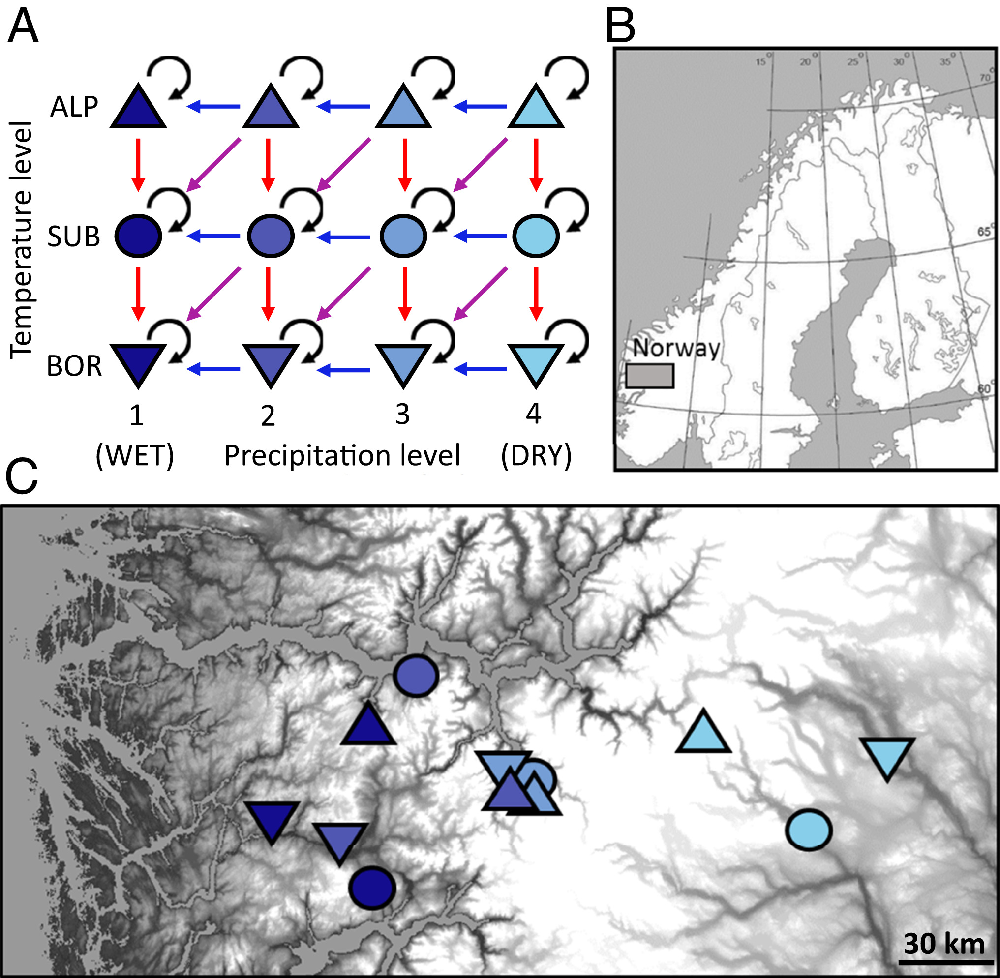
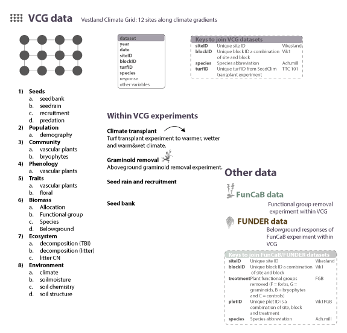

This is the GitHub repository for the Vestland Climate Grid (VCG) and
the associate data paper: Vandvik et al. (in prep). Ten years of plant
community response to climate change - data from whole-community
turf-transplant experiments across broad-scale temperature and
precipitation gradients in Western Norway.

# INTRODUCTION

# METHODS

## Research sites

Our study is conducted as a replicated distributed experiment across
twelve calcareous grassland sites in southern Norway. Careful site
selection ensured that these twelve sites vary systematically in a
‘grid’ of three temperature levels crossed with four precipitation
levels. Within each site, we measured a range of site-level biotic and
abiotic data, and set up three experiments from which we measured a
range of environmental and response variables over 12 years.



## Experimental designs

Within the VCG, we performed a number of experiments.

-   Climate transplant experiments
-   Graminoid removal experiment
-   Seed rain and seedling recruitment experiments
-   Seed bank study

# DATA MANAGAEMENT

## Location of data and supporting information

Project meta-information, data documentation, data set overview and
metadata for each dataset are in the VCG data paper (in prep). Also see
below.

The raw and clean data are stored and available on
[OSF](https://osf.io/npfa9/).

All R code for the analyses from the Norwegian project is on
[GitHub](https://github.com/Between-the-Fjords/seedclim-data).

## Download data

To download the clean data from OSF use the dataDownloader package. This
is how to install and load the package.

``` r
devtools::install_github("Between-the-Fjords/dataDownloader")
library("dataDownloader")
```

Here is an example for how to download the biomass data:

The *node* is a specific code for the VCG OSF repository. The *file*
defines which specific file that needs to be downloaded. The *path*
refers to where the data should be downloaded to in your RStudio
project. And finally the *remote_path* refers to the folder on OSF,
where the data is stored.

``` r
get_file(node = "npfa9",
         file = "VCG_clean_functional_group_biomass_2010_2013-2015.csv",
         path = "clean_data",
         remote_path = "6_Biomass_data")
```

For an overview of all available datasets see Table
(@ref(tab:data-sets).

## Naming conventions

| Data or file      | Description of naming convention                                                                                                 |
|:------------------|:---------------------------------------------------------------------------------------------------------------------------------|
| Data files        | project_experiment_status_response_year.extension; e.g. VCG_clean_biomass_2009-2012.csv                                          |
| Project           | VCG                                                                                                                              |
| Experiment        | E.g. Graminoid removal                                                                                                           |
|                   |                                                                                                                                  |
| siteID            | Unique site nmae; e.g. Ulvehaugen (see full list of sites below)                                                                 |
| blockID           | Unique blockID consisting of first 3 letters of site and block nr; e.g. Ves3                                                     |
| originPlotID      | Unique origin plotID, numeric value; e.g. 271                                                                                    |
| destinationPlotID | Unique destination plotID, numeric value; e.g. 211                                                                               |
| turfID            | Unique turfID containing originPlotID, transplant treatment and destinationPlotID; e.g. 234 TT3 332                              |
| TTtreat           | Turf transplant treatment including TTC = untouched control, TT1 = local transplant, TT2 warm, TT3 = wet, TT4 warm + wet         |
| species           | Vascular plant taxon names follow for Norway Lid & Lid(Lid J & Lid, 2010). First three digits of genus and species; e.g. Vio.bif |
| responses         | response variable, e.g. cover, biomass, decomposition                                                                            |

### Valid siteID

Here is the list of valid siteIDs in VCG.

| siteID          |
|:----------------|
| Fauske          |
| Vikesland       |
| Arhelleren      |
| Ovstedalen      |
| Alrust          |
| Hogsete         |
| Rambera         |
| Veskre          |
| Ulvehaugen      |
| Lavisdalen      |
| Gudmedalen      |
| Skjelingahaugen |

Below is code to clean the site names. On the left side are the *old
names* (e.g. Gud) that you want to replace (change to what fits your
data). And on the right side are *valid names*, which will replace the
old names (don’t change!).

``` r
# code to clean site names
dat |> 
  mutate(siteID = recode(siteID, 
         'Gud' = "Gudmedalen",
         'Lad' = "Lavisdalen",
         'Ram' = "Rambera",
         'Ulv' = "Ulvehaugen",
         'Skj' = "Skjelingahaugen",
         'Alr' = "Alrust",
         'Arh' = "Arhelleren",
         'Fau' = "Fauske",
         'Hog' = "Hogsete",
         'Ovs' = "Ovstedalen",
         'Vik' = "Vikesland",
         'Ves' = "Veskre"))
```

# DATASETS

Here is an overview over all the datasets.

<table>
<caption>
All avalble datasets with name, time period of data collection, level at
which they were collected and file name on OSF.
</caption>
<thead>
<tr>
<th style="text-align:left;">
Variable
</th>
<th style="text-align:left;">
Period
</th>
<th style="text-align:left;">
Level
</th>
<th style="text-align:left;">
File
</th>
</tr>
</thead>
<tbody>
<tr grouplength="4">
<td colspan="4" style="border-bottom: 1px solid;">
<strong>1) Seeds</strong>
</td>
</tr>
<tr>
<td style="text-align:left;padding-left: 2em;" indentlevel="1">
seedbank
</td>
<td style="text-align:left;">
2009
</td>
<td style="text-align:left;">
block
</td>
<td style="text-align:left;">
VCG_clean_seedbank.xlsx
</td>
</tr>
<tr>
<td style="text-align:left;padding-left: 2em;" indentlevel="1">
seedrain
</td>
<td style="text-align:left;">
2010
</td>
<td style="text-align:left;">
block
</td>
<td style="text-align:left;">
VCG_clean_seedrain.csv
</td>
</tr>
<tr>
<td style="text-align:left;padding-left: 2em;" indentlevel="1">
recruitment
</td>
<td style="text-align:left;">
2009-2012
</td>
<td style="text-align:left;">
??
</td>
<td style="text-align:left;">
???
</td>
</tr>
<tr>
<td style="text-align:left;padding-left: 2em;" indentlevel="1">
predation
</td>
<td style="text-align:left;">
2018
</td>
<td style="text-align:left;">
site
</td>
<td style="text-align:left;">
VCG_clean_seed_predation_2018.csv
</td>
</tr>
<tr grouplength="1">
<td colspan="4" style="border-bottom: 1px solid;">
<strong>2) Population</strong>
</td>
</tr>
<tr>
<td style="text-align:left;padding-left: 2em;" indentlevel="1">
demography
</td>
<td style="text-align:left;">
??
</td>
<td style="text-align:left;">
plot
</td>
<td style="text-align:left;">
in prep
</td>
</tr>
<tr grouplength="2">
<td colspan="4" style="border-bottom: 1px solid;">
<strong>3) Community</strong>
</td>
</tr>
<tr>
<td style="text-align:left;padding-left: 2em;" indentlevel="1">
vascular plants
</td>
<td style="text-align:left;">
2009-2019
</td>
<td style="text-align:left;">
plot
</td>
<td style="text-align:left;">
seedcloim.2020.4.15.zip
</td>
</tr>
<tr>
<td style="text-align:left;padding-left: 2em;" indentlevel="1">
bryophytes
</td>
<td style="text-align:left;">
2012-2014
</td>
<td style="text-align:left;">
plot
</td>
<td style="text-align:left;">
in prep
</td>
</tr>
<tr grouplength="1">
<td colspan="4" style="border-bottom: 1px solid;">
<strong>4) Phenology</strong>
</td>
</tr>
<tr>
<td style="text-align:left;padding-left: 2em;" indentlevel="1">
vascular plants
</td>
<td style="text-align:left;">
2014-2015
</td>
<td style="text-align:left;">
plot
</td>
<td style="text-align:left;">
VCG_clean_community_phenology_2014
</td>
</tr>
<tr grouplength="2">
<td colspan="4" style="border-bottom: 1px solid;">
<strong>5) Traits</strong>
</td>
</tr>
<tr>
<td style="text-align:left;padding-left: 2em;" indentlevel="1">
vascular plants leaf
</td>
<td style="text-align:left;">
2012, 2016
</td>
<td style="text-align:left;">
site
</td>
<td style="text-align:left;">
VCG_clean_trait_data_2012-2016.csv
</td>
</tr>
<tr>
<td style="text-align:left;padding-left: 2em;" indentlevel="1">
vascular plants floral
</td>
<td style="text-align:left;">
2019
</td>
<td style="text-align:left;">
site
</td>
<td style="text-align:left;">
in prep
</td>
</tr>
<tr grouplength="5">
<td colspan="4" style="border-bottom: 1px solid;">
<strong>6) Biomass</strong>
</td>
</tr>
<tr>
<td style="text-align:left;padding-left: 2em;" indentlevel="1">
allocation
</td>
<td style="text-align:left;">
2010
</td>
<td style="text-align:left;">
block
</td>
<td style="text-align:left;">
VCG_clean_biomass_allocation_2009.csv
</td>
</tr>
<tr>
<td style="text-align:left;padding-left: 2em;" indentlevel="1">
functional groups
</td>
<td style="text-align:left;">
2010, 2013-2015
</td>
<td style="text-align:left;">
plot/block
</td>
<td style="text-align:left;">
VCG_clean_functional_group_biomass_2010_2013-2015.csv
</td>
</tr>
<tr>
<td style="text-align:left;padding-left: 2em;" indentlevel="1">
species
</td>
<td style="text-align:left;">
2013
</td>
<td style="text-align:left;">
block
</td>
<td style="text-align:left;">
VCG_clean_species_level_biomass_2013.csv
</td>
</tr>
<tr>
<td style="text-align:left;padding-left: 2em;" indentlevel="1">
belowground biomass and productivity
</td>
<td style="text-align:left;">
2013-2014
</td>
<td style="text-align:left;">
block
</td>
<td style="text-align:left;">
belowground
</td>
</tr>
<tr>
<td style="text-align:left;padding-left: 2em;" indentlevel="1">
graminoid removal
</td>
<td style="text-align:left;">
2011-2018
</td>
<td style="text-align:left;">
plot
</td>
<td style="text-align:left;">
VCG_clean_graminoid_removal_biomass_2011-2018.csv
</td>
</tr>
<tr grouplength="3">
<td colspan="4" style="border-bottom: 1px solid;">
<strong>7) Ecosystem</strong>
</td>
</tr>
<tr>
<td style="text-align:left;padding-left: 2em;" indentlevel="1">
decomposition (TBI)
</td>
<td style="text-align:left;">
2014-2016
</td>
<td style="text-align:left;">
block
</td>
<td style="text-align:left;">
VCG_clean_decomposition_teabag_2014.csv
</td>
</tr>
<tr>
<td style="text-align:left;padding-left: 2em;" indentlevel="1">
decomposition (litter)
</td>
<td style="text-align:left;">
2016-2017
</td>
<td style="text-align:left;">
block
</td>
<td style="text-align:left;">
VCG_clean_decomposition_litter_2016.csv
</td>
</tr>
<tr>
<td style="text-align:left;padding-left: 2em;" indentlevel="1">
litter CN
</td>
<td style="text-align:left;">
2016
</td>
<td style="text-align:left;">
litter CN
</td>
<td style="text-align:left;">
VCG_clean_litter_cn_2016.csv
</td>
</tr>
<tr grouplength="4">
<td colspan="4" style="border-bottom: 1px solid;">
<strong>8) Environment</strong>
</td>
</tr>
<tr>
<td style="text-align:left;padding-left: 2em;" indentlevel="1">
climate
</td>
<td style="text-align:left;">
2009-2022
</td>
<td style="text-align:left;">
site
</td>
<td style="text-align:left;">
several files
</td>
</tr>
<tr>
<td style="text-align:left;padding-left: 2em;" indentlevel="1">
soilmoisture
</td>
<td style="text-align:left;">
2010, 2015-2018
</td>
<td style="text-align:left;">
plot
</td>
<td style="text-align:left;">
VCG_clean_soilmoisture_plotlevel_2015-2018.csv
</td>
</tr>
<tr>
<td style="text-align:left;padding-left: 2em;" indentlevel="1">
soil chemistry
</td>
<td style="text-align:left;">
2010
</td>
<td style="text-align:left;">
site
</td>
<td style="text-align:left;">
soil chemistry
</td>
</tr>
<tr>
<td style="text-align:left;padding-left: 2em;" indentlevel="1">
soil structure
</td>
<td style="text-align:left;">
2019
</td>
<td style="text-align:left;">
site
</td>
<td style="text-align:left;">
VCG_clean_soil_structure_2013_2014_2018.csv
</td>
</tr>
</tbody>
</table>



## Data dictionaries

### 1 Seed data

#### Seedbank

**Seedbank**

<table>
<thead>
<tr>
<th style="text-align:left;">
Variable name
</th>
<th style="text-align:left;">
Description
</th>
<th style="text-align:left;">
Variable type
</th>
<th style="text-align:left;">
Variable range or levels
</th>
<th style="text-align:left;">
Units/treatment level
</th>
<th style="text-align:left;">
How measured
</th>
</tr>
</thead>
<tbody>
<tr>
<td style="text-align:left;">
year
</td>
<td style="text-align:left;">
Year of sampling
</td>
<td style="text-align:left;">
numeric
</td>
<td style="text-align:left;">
2009 - 2009
</td>
<td style="text-align:left;">
2012
</td>
<td style="text-align:left;">
defined
</td>
</tr>
<tr>
<td style="text-align:left;">
siteID
</td>
<td style="text-align:left;">
Unique site ID
</td>
<td style="text-align:left;">
categorical
</td>
<td style="text-align:left;">
Alrust - Vikesland
</td>
<td style="text-align:left;">
Alrust
</td>
<td style="text-align:left;">
defined
</td>
</tr>
<tr>
<td style="text-align:left;">
replicate
</td>
<td style="text-align:left;">
Replicate per plot
</td>
<td style="text-align:left;">
numeric
</td>
<td style="text-align:left;">
1 - 5
</td>
<td style="text-align:left;">
NA
</td>
<td style="text-align:left;">
defined
</td>
</tr>
<tr>
<td style="text-align:left;">
species
</td>
<td style="text-align:left;">
Three letter genus and spcies name
</td>
<td style="text-align:left;">
categorical
</td>
<td style="text-align:left;">
Achillea.millefolium - Viola.tricolor
</td>
<td style="text-align:left;">
Kna.arv
</td>
<td style="text-align:left;">
identified
</td>
</tr>
<tr>
<td style="text-align:left;">
replicate
</td>
<td style="text-align:left;">
Replicate plot noumber per site
</td>
<td style="text-align:left;">
numeric
</td>
<td style="text-align:left;">
1 - 5
</td>
<td style="text-align:left;">
count
</td>
<td style="text-align:left;">
defined
</td>
</tr>
<tr>
<td style="text-align:left;">
sampling_scale_cm2
</td>
<td style="text-align:left;">
Spatial scale of sampling
</td>
<td style="text-align:left;">
numeric
</td>
<td style="text-align:left;">
4 - 4096
</td>
<td style="text-align:left;">
cm2
</td>
<td style="text-align:left;">
defined
</td>
</tr>
<tr>
<td style="text-align:left;">
nr_individual
</td>
<td style="text-align:left;">
Number of seeds
</td>
<td style="text-align:left;">
numeric
</td>
<td style="text-align:left;">
0 - 5804
</td>
<td style="text-align:left;">
NA
</td>
<td style="text-align:left;">
defined
</td>
</tr>
<tr>
<td style="text-align:left;">
nr_species
</td>
<td style="text-align:left;">
Number of species
</td>
<td style="text-align:left;">
numeric
</td>
<td style="text-align:left;">
0 - 52
</td>
<td style="text-align:left;">
NA
</td>
<td style="text-align:left;">
measured
</td>
</tr>
<tr>
<td style="text-align:left;">
species
</td>
<td style="text-align:left;">
Genus and species name
</td>
<td style="text-align:left;">
categorical
</td>
<td style="text-align:left;">
Achillea.millefolium - Viola.tricolor
</td>
<td style="text-align:left;">
NA
</td>
<td style="text-align:left;">
identified
</td>
</tr>
<tr>
<td style="text-align:left;">
nr_seeds
</td>
<td style="text-align:left;">
Number of seeds
</td>
<td style="text-align:left;">
numeric
</td>
<td style="text-align:left;">
0 - 4496
</td>
<td style="text-align:left;">
count
</td>
<td style="text-align:left;">
recorded
</td>
</tr>
</tbody>
</table>
**Vegetation**
<table>
<thead>
<tr>
<th style="text-align:left;">
Variable name
</th>
<th style="text-align:left;">
Description
</th>
<th style="text-align:left;">
Variable type
</th>
<th style="text-align:left;">
Variable range or levels
</th>
<th style="text-align:left;">
Units/treatment level
</th>
<th style="text-align:left;">
How measured
</th>
</tr>
</thead>
<tbody>
<tr>
<td style="text-align:left;">
year
</td>
<td style="text-align:left;">
Year of sampling
</td>
<td style="text-align:left;">
numeric
</td>
<td style="text-align:left;">
2009 - 2009
</td>
<td style="text-align:left;">
2012
</td>
<td style="text-align:left;">
defined
</td>
</tr>
<tr>
<td style="text-align:left;">
siteID
</td>
<td style="text-align:left;">
Unique site ID
</td>
<td style="text-align:left;">
categorical
</td>
<td style="text-align:left;">
Alrust - Vikesland
</td>
<td style="text-align:left;">
Alrust
</td>
<td style="text-align:left;">
defined
</td>
</tr>
<tr>
<td style="text-align:left;">
replicate
</td>
<td style="text-align:left;">
Replicate per plot
</td>
<td style="text-align:left;">
numeric
</td>
<td style="text-align:left;">
1 - 3
</td>
<td style="text-align:left;">
NA
</td>
<td style="text-align:left;">
defined
</td>
</tr>
<tr>
<td style="text-align:left;">
species
</td>
<td style="text-align:left;">
Three letter genus and spcies name
</td>
<td style="text-align:left;">
categorical
</td>
<td style="text-align:left;">
Achillea.millefolium - Viola.tricolor
</td>
<td style="text-align:left;">
Kna.arv
</td>
<td style="text-align:left;">
identified
</td>
</tr>
<tr>
<td style="text-align:left;">
replicate
</td>
<td style="text-align:left;">
Replicate plot noumber per site
</td>
<td style="text-align:left;">
numeric
</td>
<td style="text-align:left;">
1 - 3
</td>
<td style="text-align:left;">
count
</td>
<td style="text-align:left;">
defined
</td>
</tr>
<tr>
<td style="text-align:left;">
sampling_scale_cm2
</td>
<td style="text-align:left;">
Spatial scale of sampling
</td>
<td style="text-align:left;">
numeric
</td>
<td style="text-align:left;">
4 - 16384
</td>
<td style="text-align:left;">
cm2
</td>
<td style="text-align:left;">
defined
</td>
</tr>
<tr>
<td style="text-align:left;">
nr_species
</td>
<td style="text-align:left;">
Number of species
</td>
<td style="text-align:left;">
numeric
</td>
<td style="text-align:left;">
0 - 44
</td>
<td style="text-align:left;">
NA
</td>
<td style="text-align:left;">
measured
</td>
</tr>
<tr>
<td style="text-align:left;">
species
</td>
<td style="text-align:left;">
Genus and species name
</td>
<td style="text-align:left;">
categorical
</td>
<td style="text-align:left;">
Achillea.millefolium - Viola.tricolor
</td>
<td style="text-align:left;">
NA
</td>
<td style="text-align:left;">
identified
</td>
</tr>
<tr>
<td style="text-align:left;">
presence
</td>
<td style="text-align:left;">
Presence (1) or absence (0) of species
</td>
<td style="text-align:left;">
numeric
</td>
<td style="text-align:left;">
0 - 2
</td>
<td style="text-align:left;">
binomial
</td>
<td style="text-align:left;">
recorded
</td>
</tr>
</tbody>
</table>

#### Seedrain

<table>
<thead>
<tr>
<th style="text-align:left;">
Variable name
</th>
<th style="text-align:left;">
Description
</th>
<th style="text-align:left;">
Variable type
</th>
<th style="text-align:left;">
Variable range or levels
</th>
<th style="text-align:left;">
Units/treatment level
</th>
<th style="text-align:left;">
How measured
</th>
</tr>
</thead>
<tbody>
<tr>
<td style="text-align:left;">
year
</td>
<td style="text-align:left;">
Year of sampling
</td>
<td style="text-align:left;">
numeric
</td>
<td style="text-align:left;">
2010 - 2010
</td>
<td style="text-align:left;">
2012
</td>
<td style="text-align:left;">
defined
</td>
</tr>
<tr>
<td style="text-align:left;">
siteID
</td>
<td style="text-align:left;">
Unique site ID
</td>
<td style="text-align:left;">
categorical
</td>
<td style="text-align:left;">
Alrust - Vikesland
</td>
<td style="text-align:left;">
Alrust
</td>
<td style="text-align:left;">
defined
</td>
</tr>
<tr>
<td style="text-align:left;">
blockID
</td>
<td style="text-align:left;">
Unique blockID
</td>
<td style="text-align:left;">
categorical
</td>
<td style="text-align:left;">
Alr1 - Vik5
</td>
<td style="text-align:left;">
NA
</td>
<td style="text-align:left;">
defined
</td>
</tr>
<tr>
<td style="text-align:left;">
species
</td>
<td style="text-align:left;">
Three letter genus and spcies name
</td>
<td style="text-align:left;">
categorical
</td>
<td style="text-align:left;">
Ach.mil - Viol.sp
</td>
<td style="text-align:left;">
Kna.arv
</td>
<td style="text-align:left;">
identified
</td>
</tr>
<tr>
<td style="text-align:left;">
nr_seed
</td>
<td style="text-align:left;">
Counts of seed
</td>
<td style="text-align:left;">
numeric
</td>
<td style="text-align:left;">
0 - 499
</td>
<td style="text-align:left;">
count
</td>
<td style="text-align:left;">
measured
</td>
</tr>
<tr>
<td style="text-align:left;">
cover
</td>
<td style="text-align:left;">
Cover of plant species in plot
</td>
<td style="text-align:left;">
numeric
</td>
<td style="text-align:left;">
0 - 75
</td>
<td style="text-align:left;">
percentage
</td>
<td style="text-align:left;">
measured
</td>
</tr>
</tbody>
</table>

#### Seed predation

<table>
<thead>
<tr>
<th style="text-align:left;">
Variable name
</th>
<th style="text-align:left;">
Description
</th>
<th style="text-align:left;">
Variable type
</th>
<th style="text-align:left;">
Variable range or levels
</th>
<th style="text-align:left;">
Units/treatment level
</th>
<th style="text-align:left;">
How measured
</th>
</tr>
</thead>
<tbody>
<tr>
<td style="text-align:left;">
year
</td>
<td style="text-align:left;">
Year of sampling
</td>
<td style="text-align:left;">
numeric
</td>
<td style="text-align:left;">
2018 - 2018
</td>
<td style="text-align:left;">
2012
</td>
<td style="text-align:left;">
defined
</td>
</tr>
<tr>
<td style="text-align:left;">
siteID
</td>
<td style="text-align:left;">
Unique site ID
</td>
<td style="text-align:left;">
categorical
</td>
<td style="text-align:left;">
Alrust - Vikesland
</td>
<td style="text-align:left;">
Alrust
</td>
<td style="text-align:left;">
defined
</td>
</tr>
<tr>
<td style="text-align:left;">
biogeographic_zone
</td>
<td style="text-align:left;">
Biogeographic zone
</td>
<td style="text-align:left;">
categorical
</td>
<td style="text-align:left;">
alpine - sub.alpine
</td>
<td style="text-align:left;">
boreal, sub.alpine, alpine
</td>
<td style="text-align:left;">
defined
</td>
</tr>
<tr>
<td style="text-align:left;">
annual_precipitation_gridded
</td>
<td style="text-align:left;">
Annual precipitation
</td>
<td style="text-align:left;">
numeric
</td>
<td style="text-align:left;">
0.597 - 3.029
</td>
<td style="text-align:left;">
Annual precipitation in m
</td>
<td style="text-align:left;">
defined
</td>
</tr>
<tr>
<td style="text-align:left;">
weather
</td>
<td style="text-align:left;">
Weather during data collection
</td>
<td style="text-align:left;">
categorical
</td>
<td style="text-align:left;">
rainy - sun
</td>
<td style="text-align:left;">
sun, rainy
</td>
<td style="text-align:left;">
recorded
</td>
</tr>
</tbody>
</table>

### 3 Community data

#### Plant community

<table>
<thead>
<tr>
<th style="text-align:left;">
TableID
</th>
<th style="text-align:left;">
Variable name
</th>
<th style="text-align:left;">
Description
</th>
<th style="text-align:left;">
Variable type
</th>
<th style="text-align:left;">
Variable range or levels
</th>
<th style="text-align:left;">
Units/treatment level
</th>
<th style="text-align:left;">
How measured
</th>
</tr>
</thead>
<tbody>
<tr>
<td style="text-align:left;">
site
</td>
<td style="text-align:left;">
siteID
</td>
<td style="text-align:left;">
Unique site ID
</td>
<td style="text-align:left;">
categorical
</td>
<td style="text-align:left;">
Alrust - Vikesland
</td>
<td style="text-align:left;">
Alrust
</td>
<td style="text-align:left;">
defined
</td>
</tr>
<tr>
<td style="text-align:left;">
site
</td>
<td style="text-align:left;">
norwegian_name
</td>
<td style="text-align:left;">
Norwegian species name
</td>
<td style="text-align:left;">
categorical
</td>
<td style="text-align:left;">
Ålrust - Vikesland
</td>
<td style="text-align:left;">
NA
</td>
<td style="text-align:left;">
literature
</td>
</tr>
<tr>
<td style="text-align:left;">
site
</td>
<td style="text-align:left;">
site_code
</td>
<td style="text-align:left;">
Site ID as a combination of biogeographic zone and precipitation level
</td>
<td style="text-align:left;">
categorical
</td>
<td style="text-align:left;">
alp1 - sub4
</td>
<td style="text-align:left;">
Alp1
</td>
<td style="text-align:left;">
defined
</td>
</tr>
<tr>
<td style="text-align:left;">
site
</td>
<td style="text-align:left;">
latitude
</td>
<td style="text-align:left;">
coordinate of site
</td>
<td style="text-align:left;">
numeric
</td>
<td style="text-align:left;">
60.5445 - 61.0866
</td>
<td style="text-align:left;">
decimal degree
</td>
<td style="text-align:left;">
measured
</td>
</tr>
<tr>
<td style="text-align:left;">
site
</td>
<td style="text-align:left;">
longitude
</td>
<td style="text-align:left;">
coordinate of site
</td>
<td style="text-align:left;">
numeric
</td>
<td style="text-align:left;">
5.96487 - 9.07876
</td>
<td style="text-align:left;">
decimal degree
</td>
<td style="text-align:left;">
measured
</td>
</tr>
<tr>
<td style="text-align:left;">
site
</td>
<td style="text-align:left;">
elevation
</td>
<td style="text-align:left;">
elevation derived from DEM
</td>
<td style="text-align:left;">
numeric
</td>
<td style="text-align:left;">
346 - 1213
</td>
<td style="text-align:left;">
meter above sea level
</td>
<td style="text-align:left;">
measured
</td>
</tr>
<tr>
<td style="text-align:left;">
site
</td>
<td style="text-align:left;">
biogeographic_zone
</td>
<td style="text-align:left;">
Biogeographic zone
</td>
<td style="text-align:left;">
categorical
</td>
<td style="text-align:left;">
Low-alpine - Sub-alpine
</td>
<td style="text-align:left;">
Low-alpine
</td>
<td style="text-align:left;">
defined
</td>
</tr>
<tr>
<td style="text-align:left;">
site
</td>
<td style="text-align:left;">
biogeographic_section
</td>
<td style="text-align:left;">
Biogeographic section
</td>
<td style="text-align:left;">
categorical
</td>
<td style="text-align:left;">
O1 - OC
</td>
<td style="text-align:left;">
O2
</td>
<td style="text-align:left;">
defined
</td>
</tr>
<tr>
<td style="text-align:left;">
site
</td>
<td style="text-align:left;">
annual_precipitation_gridded
</td>
<td style="text-align:left;">
Downscaled annual precipitation
</td>
<td style="text-align:left;">
numeric
</td>
<td style="text-align:left;">
596.348 - 3028.69
</td>
<td style="text-align:left;">
mm
</td>
<td style="text-align:left;">
measured
</td>
</tr>
<tr>
<td style="text-align:left;">
site
</td>
<td style="text-align:left;">
temperature_level
</td>
<td style="text-align:left;">
Numeric value for temperature level
</td>
<td style="text-align:left;">
numeric
</td>
<td style="text-align:left;">
1 - 3
</td>
<td style="text-align:left;">
1-3
</td>
<td style="text-align:left;">
defined
</td>
</tr>
<tr>
<td style="text-align:left;">
site
</td>
<td style="text-align:left;">
summer_temperature_gridded
</td>
<td style="text-align:left;">
Downscaled summer temperature
</td>
<td style="text-align:left;">
numeric
</td>
<td style="text-align:left;">
5.86638 - 10.7775
</td>
<td style="text-align:left;">
degree celcius
</td>
<td style="text-align:left;">
measured
</td>
</tr>
<tr>
<td style="text-align:left;">
site
</td>
<td style="text-align:left;">
precipitation_level
</td>
<td style="text-align:left;">
Numeric value for precipitation level
</td>
<td style="text-align:left;">
numeric
</td>
<td style="text-align:left;">
1 - 4
</td>
<td style="text-align:left;">
1-4
</td>
<td style="text-align:left;">
defined
</td>
</tr>
<tr>
<td style="text-align:left;">
blocks
</td>
<td style="text-align:left;">
blockID
</td>
<td style="text-align:left;">
Unique block ID as combination of three letter site code and block
number
</td>
<td style="text-align:left;">
categorical
</td>
<td style="text-align:left;">
Alr1 - Vik5
</td>
<td style="text-align:left;">
Alr1
</td>
<td style="text-align:left;">
defined
</td>
</tr>
<tr>
<td style="text-align:left;">
blocks
</td>
<td style="text-align:left;">
siteID
</td>
<td style="text-align:left;">
Unique site ID
</td>
<td style="text-align:left;">
categorical
</td>
<td style="text-align:left;">
Alrust - Vikesland
</td>
<td style="text-align:left;">
Alrust
</td>
<td style="text-align:left;">
defined
</td>
</tr>
<tr>
<td style="text-align:left;">
blocks
</td>
<td style="text-align:left;">
slope
</td>
<td style="text-align:left;">
Slope of the block
</td>
<td style="text-align:left;">
numeric
</td>
<td style="text-align:left;">
10 - 10
</td>
<td style="text-align:left;">
degree
</td>
<td style="text-align:left;">
measured
</td>
</tr>
<tr>
<td style="text-align:left;">
blocks
</td>
<td style="text-align:left;">
aspect
</td>
<td style="text-align:left;">
Aspect of the block
</td>
<td style="text-align:left;">
numeric
</td>
<td style="text-align:left;">
10 - 10
</td>
<td style="text-align:left;">
degree
</td>
<td style="text-align:left;">
measured
</td>
</tr>
<tr>
<td style="text-align:left;">
blocks
</td>
<td style="text-align:left;">
comment
</td>
<td style="text-align:left;">
NA
</td>
<td style="text-align:left;">
categorical
</td>
<td style="text-align:left;">
NA - NA
</td>
<td style="text-align:left;">
NA
</td>
<td style="text-align:left;">
NA
</td>
</tr>
<tr>
<td style="text-align:left;">
plots
</td>
<td style="text-align:left;">
plotID
</td>
<td style="text-align:left;">
Unique numeric plot ID for geographic location of the turf
</td>
<td style="text-align:left;">
numeric
</td>
<td style="text-align:left;">
-168 - 30610
</td>
<td style="text-align:left;">
1
</td>
<td style="text-align:left;">
defined
</td>
</tr>
<tr>
<td style="text-align:left;">
plots
</td>
<td style="text-align:left;">
blockID
</td>
<td style="text-align:left;">
Unique block ID as combination of three letter site code and block
number
</td>
<td style="text-align:left;">
categorical
</td>
<td style="text-align:left;">
Alr1 - Vik5
</td>
<td style="text-align:left;">
Alr1
</td>
<td style="text-align:left;">
defined
</td>
</tr>
<tr>
<td style="text-align:left;">
plots
</td>
<td style="text-align:left;">
aspect
</td>
<td style="text-align:left;">
Aspect of the block
</td>
<td style="text-align:left;">
numeric
</td>
<td style="text-align:left;">
0 - 0
</td>
<td style="text-align:left;">
degree
</td>
<td style="text-align:left;">
measured
</td>
</tr>
<tr>
<td style="text-align:left;">
plots
</td>
<td style="text-align:left;">
slope
</td>
<td style="text-align:left;">
Slope of the block
</td>
<td style="text-align:left;">
numeric
</td>
<td style="text-align:left;">
0 - 0
</td>
<td style="text-align:left;">
degree
</td>
<td style="text-align:left;">
measured
</td>
</tr>
<tr>
<td style="text-align:left;">
turfs
</td>
<td style="text-align:left;">
turfID
</td>
<td style="text-align:left;">
Unique ID of vegetation turf as originplotID, treatment and
destinationplotID
</td>
<td style="text-align:left;">
categorical
</td>
<td style="text-align:left;">
1 TT2 28 - Vik5RTG
</td>
<td style="text-align:left;">
1 TT2 28
</td>
<td style="text-align:left;">
defined
</td>
</tr>
<tr>
<td style="text-align:left;">
turfs
</td>
<td style="text-align:left;">
TTtreat
</td>
<td style="text-align:left;">
Treatment of turf transplant
</td>
<td style="text-align:left;">
categorical
</td>
<td style="text-align:left;">
TT1 - TTC
</td>
<td style="text-align:left;">
TT2
</td>
<td style="text-align:left;">
defined
</td>
</tr>
<tr>
<td style="text-align:left;">
turfs
</td>
<td style="text-align:left;">
RTtreat
</td>
<td style="text-align:left;">
Treatment of recruit tag
</td>
<td style="text-align:left;">
categorical
</td>
<td style="text-align:left;">

-   RTS
    </td>
    <td style="text-align:left;">
    RTC
    </td>
    <td style="text-align:left;">
    defined
    </td>
    </tr>
    <tr>
    <td style="text-align:left;">
    turfs
    </td>
    <td style="text-align:left;">
    GRtreat
    </td>
    <td style="text-align:left;">
    Treatment of graminoids removal
    </td>
    <td style="text-align:left;">
    categorical
    </td>
    <td style="text-align:left;">

    -   TTC
        </td>
        <td style="text-align:left;">
        RTC
        </td>
        <td style="text-align:left;">
        defined
        </td>
        </tr>
        <tr>
        <td style="text-align:left;">
        turfs
        </td>
        <td style="text-align:left;">
        originPlotID
        </td>
        <td style="text-align:left;">
        Origin location of the turf
        </td>
        <td style="text-align:left;">
        numeric
        </td>
        <td style="text-align:left;">
        -145 - 30610
        </td>
        <td style="text-align:left;">
        1
        </td>
        <td style="text-align:left;">
        defined
        </td>
        </tr>
        <tr>
        <td style="text-align:left;">
        turfs
        </td>
        <td style="text-align:left;">
        destinationPlotID
        </td>
        <td style="text-align:left;">
        Destination location of the turf
        </td>
        <td style="text-align:left;">
        numeric
        </td>
        <td style="text-align:left;">
        -168 - 30610
        </td>
        <td style="text-align:left;">
        28
        </td>
        <td style="text-align:left;">
        defined
        </td>
        </tr>
        <tr>
        <td style="text-align:left;">
        taxon
        </td>
        <td style="text-align:left;">
        species
        </td>
        <td style="text-align:left;">
        three letter codes for genus and species names
        </td>
        <td style="text-align:left;">
        categorical
        </td>
        <td style="text-align:left;">
        Ach.mil - Vis.vul
        </td>
        <td style="text-align:left;">
        Ach.mil
        </td>
        <td style="text-align:left;">
        identified
        </td>
        </tr>
        <tr>
        <td style="text-align:left;">
        taxon
        </td>
        <td style="text-align:left;">
        species_name
        </td>
        <td style="text-align:left;">
        full genus and species names
        </td>
        <td style="text-align:left;">
        categorical
        </td>
        <td style="text-align:left;">
        Achillea millefolium - Viscaria vulgaris
        </td>
        <td style="text-align:left;">
        Achillea millefolium
        </td>
        <td style="text-align:left;">
        identified
        </td>
        </tr>
        <tr>
        <td style="text-align:left;">
        taxon
        </td>
        <td style="text-align:left;">
        authority
        </td>
        <td style="text-align:left;">
        taxanomic authority
        </td>
        <td style="text-align:left;">
        categorical
        </td>
        <td style="text-align:left;">
        NA - NA
        </td>
        <td style="text-align:left;">
        NA
        </td>
        <td style="text-align:left;">
        literature
        </td>
        </tr>
        <tr>
        <td style="text-align:left;">
        taxon
        </td>
        <td style="text-align:left;">
        family
        </td>
        <td style="text-align:left;">
        Plant family name
        </td>
        <td style="text-align:left;">
        categorical
        </td>
        <td style="text-align:left;">
        Apiaceae - Woodsiaceae
        </td>
        <td style="text-align:left;">
        Asteraceae
        </td>
        <td style="text-align:left;">
        identified
        </td>
        </tr>
        <tr>
        <td style="text-align:left;">
        taxon
        </td>
        <td style="text-align:left;">
        comment
        </td>
        <td style="text-align:left;">
        NA
        </td>
        <td style="text-align:left;">
        categorical
        </td>
        <td style="text-align:left;">
        New name? - Synonym: Kalmia procumbens
        </td>
        <td style="text-align:left;">
        NA
        </td>
        <td style="text-align:left;">
        NA
        </td>
        </tr>
        <tr>
        <td style="text-align:left;">
        turf_community
        </td>
        <td style="text-align:left;">
        turfID
        </td>
        <td style="text-align:left;">
        Unique ID of vegetation turf as originplotID, treatment and
        destinationplotID
        </td>
        <td style="text-align:left;">
        categorical
        </td>
        <td style="text-align:left;">
        1 TT2 28 - Vik5RTG
        </td>
        <td style="text-align:left;">
        1 TT2 28
        </td>
        <td style="text-align:left;">
        defined
        </td>
        </tr>
        <tr>
        <td style="text-align:left;">
        turf_community
        </td>
        <td style="text-align:left;">
        year
        </td>
        <td style="text-align:left;">
        Year of the sampling
        </td>
        <td style="text-align:left;">
        numeric
        </td>
        <td style="text-align:left;">
        2009 - 2019
        </td>
        <td style="text-align:left;">
        2009
        </td>
        <td style="text-align:left;">
        defined
        </td>
        </tr>
        <tr>
        <td style="text-align:left;">
        turf_community
        </td>
        <td style="text-align:left;">
        species
        </td>
        <td style="text-align:left;">
        three letter codes for genus and species names
        </td>
        <td style="text-align:left;">
        categorical
        </td>
        <td style="text-align:left;">
        Ach.mil - Vis.vul
        </td>
        <td style="text-align:left;">
        Ach.mil
        </td>
        <td style="text-align:left;">
        identified
        </td>
        </tr>
        <tr>
        <td style="text-align:left;">
        turf_community
        </td>
        <td style="text-align:left;">
        cover
        </td>
        <td style="text-align:left;">
        Percent cover of a species in a turf
        </td>
        <td style="text-align:left;">
        numeric
        </td>
        <td style="text-align:left;">
        0.04 - 100
        </td>
        <td style="text-align:left;">
        percentage
        </td>
        <td style="text-align:left;">
        measured
        </td>
        </tr>
        <tr>
        <td style="text-align:left;">
        turf_community
        </td>
        <td style="text-align:left;">
        cf
        </td>
        <td style="text-align:left;">
        Uncertain species identification
        </td>
        <td style="text-align:left;">
        numeric
        </td>
        <td style="text-align:left;">
        0 - 0
        </td>
        <td style="text-align:left;">
        NA
        </td>
        <td style="text-align:left;">
        defined
        </td>
        </tr>
        <tr>
        <td style="text-align:left;">
        turf_community
        </td>
        <td style="text-align:left;">
        flag
        </td>
        <td style="text-align:left;">
        Values flagged for possible error
        </td>
        <td style="text-align:left;">
        categorical
        </td>
        <td style="text-align:left;">
        imputed from NID.seedling presence - Subturf w/o cover. Imputed
        as mean of adjacent years
        </td>
        <td style="text-align:left;">
        NA
        </td>
        <td style="text-align:left;">
        NA
        </td>
        </tr>
        <tr>
        <td style="text-align:left;">
        subturf_community
        </td>
        <td style="text-align:left;">
        turfID
        </td>
        <td style="text-align:left;">
        Unique ID of vegetation turf as originplotID, treatment and
        destinationplotID
        </td>
        <td style="text-align:left;">
        categorical
        </td>
        <td style="text-align:left;">
        1 TT2 28 - Vik5RTG
        </td>
        <td style="text-align:left;">
        1 TT2 28
        </td>
        <td style="text-align:left;">
        defined
        </td>
        </tr>
        <tr>
        <td style="text-align:left;">
        subturf_community
        </td>
        <td style="text-align:left;">
        subturf
        </td>
        <td style="text-align:left;">
        Location of subturf within the turf
        </td>
        <td style="text-align:left;">
        numeric
        </td>
        <td style="text-align:left;">
        1 - 25
        </td>
        <td style="text-align:left;">
        1
        </td>
        <td style="text-align:left;">
        defined
        </td>
        </tr>
        <tr>
        <td style="text-align:left;">
        subturf_community
        </td>
        <td style="text-align:left;">
        year
        </td>
        <td style="text-align:left;">
        Year of the sampling
        </td>
        <td style="text-align:left;">
        numeric
        </td>
        <td style="text-align:left;">
        2009 - 2019
        </td>
        <td style="text-align:left;">
        2009
        </td>
        <td style="text-align:left;">
        defined
        </td>
        </tr>
        <tr>
        <td style="text-align:left;">
        subturf_community
        </td>
        <td style="text-align:left;">
        species
        </td>
        <td style="text-align:left;">
        three letter codes for genus and species names
        </td>
        <td style="text-align:left;">
        categorical
        </td>
        <td style="text-align:left;">
        Ach.mil - Vis.vul
        </td>
        <td style="text-align:left;">
        Ach.mil
        </td>
        <td style="text-align:left;">
        identified
        </td>
        </tr>
        <tr>
        <td style="text-align:left;">
        subturf_community
        </td>
        <td style="text-align:left;">
        presence
        </td>
        <td style="text-align:left;">
        Presence of species
        </td>
        <td style="text-align:left;">
        categorical
        </td>
        <td style="text-align:left;">

        -   VV
            </td>
            <td style="text-align:left;">
            0-1
            </td>
            <td style="text-align:left;">
            measured
            </td>
            </tr>
            <tr>
            <td style="text-align:left;">
            subturf_community
            </td>
            <td style="text-align:left;">
            seedlings
            </td>
            <td style="text-align:left;">
            Presence of seedlings where cotyledons are visible
            </td>
            <td style="text-align:left;">
            numeric
            </td>
            <td style="text-align:left;">
            0 - 12
            </td>
            <td style="text-align:left;">
            0-1
            </td>
            <td style="text-align:left;">
            measured
            </td>
            </tr>
            <tr>
            <td style="text-align:left;">
            subturf_community
            </td>
            <td style="text-align:left;">
            juvenile
            </td>
            <td style="text-align:left;">
            Presence of juveniles that are not fully grown plants
            </td>
            <td style="text-align:left;">
            numeric
            </td>
            <td style="text-align:left;">
            0 - 12
            </td>
            <td style="text-align:left;">
            0-1
            </td>
            <td style="text-align:left;">
            measured
            </td>
            </tr>
            <tr>
            <td style="text-align:left;">
            subturf_community
            </td>
            <td style="text-align:left;">
            adult
            </td>
            <td style="text-align:left;">
            Presence of adults
            </td>
            <td style="text-align:left;">
            numeric
            </td>
            <td style="text-align:left;">
            0 - 1
            </td>
            <td style="text-align:left;">
            0-1
            </td>
            <td style="text-align:left;">
            measured
            </td>
            </tr>
            <tr>
            <td style="text-align:left;">
            subturf_community
            </td>
            <td style="text-align:left;">
            fertile
            </td>
            <td style="text-align:left;">
            Presence of fertile
            </td>
            <td style="text-align:left;">
            numeric
            </td>
            <td style="text-align:left;">
            0 - 1
            </td>
            <td style="text-align:left;">
            0-1
            </td>
            <td style="text-align:left;">
            measured
            </td>
            </tr>
            <tr>
            <td style="text-align:left;">
            subturf_community
            </td>
            <td style="text-align:left;">
            vegetative
            </td>
            <td style="text-align:left;">
            Presence of vegetative
            </td>
            <td style="text-align:left;">
            numeric
            </td>
            <td style="text-align:left;">
            0 - 1
            </td>
            <td style="text-align:left;">
            0-1
            </td>
            <td style="text-align:left;">
            measured
            </td>
            </tr>
            <tr>
            <td style="text-align:left;">
            subturf_community
            </td>
            <td style="text-align:left;">
            dominant
            </td>
            <td style="text-align:left;">
            Species cover more than 50 percent of subturf
            </td>
            <td style="text-align:left;">
            numeric
            </td>
            <td style="text-align:left;">
            0 - 1
            </td>
            <td style="text-align:left;">
            0-1
            </td>
            <td style="text-align:left;">
            measured
            </td>
            </tr>
            <tr>
            <td style="text-align:left;">
            subturf_community
            </td>
            <td style="text-align:left;">
            cf
            </td>
            <td style="text-align:left;">
            Uncertain species identification
            </td>
            <td style="text-align:left;">
            numeric
            </td>
            <td style="text-align:left;">
            0 - 1
            </td>
            <td style="text-align:left;">
            NA
            </td>
            <td style="text-align:left;">
            defined
            </td>
            </tr>
            <tr>
            <td style="text-align:left;">
            subturf_community
            </td>
            <td style="text-align:left;">
            flag
            </td>
            <td style="text-align:left;">
            Values flagged for possible error
            </td>
            <td style="text-align:left;">
            categorical
            </td>
            <td style="text-align:left;">
            NA - NA
            </td>
            <td style="text-align:left;">
            NA
            </td>
            <td style="text-align:left;">
            NA
            </td>
            </tr>
            <tr>
            <td style="text-align:left;">
            turf_environment
            </td>
            <td style="text-align:left;">
            turfID
            </td>
            <td style="text-align:left;">
            Unique ID of vegetation turf as originplotID, treatment and
            destinationplotID
            </td>
            <td style="text-align:left;">
            categorical
            </td>
            <td style="text-align:left;">
            1 TT2 28 - Vik5RTG
            </td>
            <td style="text-align:left;">
            1 TT2 28
            </td>
            <td style="text-align:left;">
            defined
            </td>
            </tr>
            <tr>
            <td style="text-align:left;">
            turf_environment
            </td>
            <td style="text-align:left;">
            year
            </td>
            <td style="text-align:left;">
            Year of the sampling
            </td>
            <td style="text-align:left;">
            numeric
            </td>
            <td style="text-align:left;">
            2009 - 2019
            </td>
            <td style="text-align:left;">
            2009
            </td>
            <td style="text-align:left;">
            defined
            </td>
            </tr>
            <tr>
            <td style="text-align:left;">
            turf_environment
            </td>
            <td style="text-align:left;">
            pleuro
            </td>
            <td style="text-align:left;">
            Cover of pleurocarp per (sub)turf
            </td>
            <td style="text-align:left;">
            numeric
            </td>
            <td style="text-align:left;">
            0 - 100
            </td>
            <td style="text-align:left;">
            percentage
            </td>
            <td style="text-align:left;">
            measured
            </td>
            </tr>
            <tr>
            <td style="text-align:left;">
            turf_environment
            </td>
            <td style="text-align:left;">
            acro
            </td>
            <td style="text-align:left;">
            Cover of acrocarp per (sub)turf
            </td>
            <td style="text-align:left;">
            numeric
            </td>
            <td style="text-align:left;">
            0 - 66
            </td>
            <td style="text-align:left;">
            percentage
            </td>
            <td style="text-align:left;">
            measured
            </td>
            </tr>
            <tr>
            <td style="text-align:left;">
            turf_environment
            </td>
            <td style="text-align:left;">
            liver
            </td>
            <td style="text-align:left;">
            Cover of liverworth per (sub)turf
            </td>
            <td style="text-align:left;">
            numeric
            </td>
            <td style="text-align:left;">
            0 - 34.12
            </td>
            <td style="text-align:left;">
            percentage
            </td>
            <td style="text-align:left;">
            measured
            </td>
            </tr>
            <tr>
            <td style="text-align:left;">
            turf_environment
            </td>
            <td style="text-align:left;">
            lichen
            </td>
            <td style="text-align:left;">
            Cover of lichen per (sub)turf
            </td>
            <td style="text-align:left;">
            numeric
            </td>
            <td style="text-align:left;">
            0 - 75
            </td>
            <td style="text-align:left;">
            percentage
            </td>
            <td style="text-align:left;">
            measured
            </td>
            </tr>
            <tr>
            <td style="text-align:left;">
            turf_environment
            </td>
            <td style="text-align:left;">
            litter
            </td>
            <td style="text-align:left;">
            Cover of litter per (sub)turf
            </td>
            <td style="text-align:left;">
            numeric
            </td>
            <td style="text-align:left;">
            0 - 95
            </td>
            <td style="text-align:left;">
            percentage
            </td>
            <td style="text-align:left;">
            measured
            </td>
            </tr>
            <tr>
            <td style="text-align:left;">
            turf_environment
            </td>
            <td style="text-align:left;">
            soil
            </td>
            <td style="text-align:left;">
            Cover of soil per (sub)turf
            </td>
            <td style="text-align:left;">
            numeric
            </td>
            <td style="text-align:left;">
            0 - 95
            </td>
            <td style="text-align:left;">
            percentage
            </td>
            <td style="text-align:left;">
            measured
            </td>
            </tr>
            <tr>
            <td style="text-align:left;">
            turf_environment
            </td>
            <td style="text-align:left;">
            rock
            </td>
            <td style="text-align:left;">
            Cover of rock per (sub)turf
            </td>
            <td style="text-align:left;">
            numeric
            </td>
            <td style="text-align:left;">
            0 - 40
            </td>
            <td style="text-align:left;">
            percentage
            </td>
            <td style="text-align:left;">
            measured
            </td>
            </tr>
            <tr>
            <td style="text-align:left;">
            turf_environment
            </td>
            <td style="text-align:left;">
            total_vascular
            </td>
            <td style="text-align:left;">
            Total percent cover by vascular plants
            </td>
            <td style="text-align:left;">
            numeric
            </td>
            <td style="text-align:left;">
            1 - 100
            </td>
            <td style="text-align:left;">
            percent
            </td>
            <td style="text-align:left;">
            measured
            </td>
            </tr>
            <tr>
            <td style="text-align:left;">
            turf_environment
            </td>
            <td style="text-align:left;">
            total_bryophytes
            </td>
            <td style="text-align:left;">
            Total percent cover by bryophytes
            </td>
            <td style="text-align:left;">
            numeric
            </td>
            <td style="text-align:left;">
            0 - 100
            </td>
            <td style="text-align:left;">
            percent
            </td>
            <td style="text-align:left;">
            measured
            </td>
            </tr>
            <tr>
            <td style="text-align:left;">
            turf_environment
            </td>
            <td style="text-align:left;">
            total_lichen
            </td>
            <td style="text-align:left;">
            Total percent cover by lichens
            </td>
            <td style="text-align:left;">
            numeric
            </td>
            <td style="text-align:left;">
            0 - 90
            </td>
            <td style="text-align:left;">
            percent
            </td>
            <td style="text-align:left;">
            measured
            </td>
            </tr>
            <tr>
            <td style="text-align:left;">
            turf_environment
            </td>
            <td style="text-align:left;">
            vegetation_height
            </td>
            <td style="text-align:left;">
            Average height of the vascular vegetation in the plot
            </td>
            <td style="text-align:left;">
            numeric
            </td>
            <td style="text-align:left;">
            0 - 237.5
            </td>
            <td style="text-align:left;">
            cm
            </td>
            <td style="text-align:left;">
            measured
            </td>
            </tr>
            <tr>
            <td style="text-align:left;">
            turf_environment
            </td>
            <td style="text-align:left;">
            moss_height
            </td>
            <td style="text-align:left;">
            Average height of the mosses
            </td>
            <td style="text-align:left;">
            numeric
            </td>
            <td style="text-align:left;">
            0 - 75
            </td>
            <td style="text-align:left;">
            cm
            </td>
            <td style="text-align:left;">
            measured
            </td>
            </tr>
            <tr>
            <td style="text-align:left;">
            turf_environment
            </td>
            <td style="text-align:left;">
            comment
            </td>
            <td style="text-align:left;">
            NA
            </td>
            <td style="text-align:left;">
            categorical
            </td>
            <td style="text-align:left;">

            -   X1c
                </td>
                <td style="text-align:left;">
                NA
                </td>
                <td style="text-align:left;">
                NA
                </td>
                </tr>
                <tr>
                <td style="text-align:left;">
                turf_environment
                </td>
                <td style="text-align:left;">
                recorder
                </td>
                <td style="text-align:left;">
                Observer of the vegetation
                </td>
                <td style="text-align:left;">
                categorical
                </td>
                <td style="text-align:left;">
                AB - Vigdis/Kari
                </td>
                <td style="text-align:left;">
                NA
                </td>
                <td style="text-align:left;">
                defined
                </td>
                </tr>
                <tr>
                <td style="text-align:left;">
                turf_environment
                </td>
                <td style="text-align:left;">
                date
                </td>
                <td style="text-align:left;">
                Date of observation
                </td>
                <td style="text-align:left;">
                categorical
                </td>
                <td style="text-align:left;">

                -   missing data
                    </td>
                    <td style="text-align:left;">
                    yyyy-mm-dd
                    </td>
                    <td style="text-align:left;">
                    recorded
                    </td>
                    </tr>
                    <tr>
                    <td style="text-align:left;">
                    subturf_environment
                    </td>
                    <td style="text-align:left;">
                    turfID
                    </td>
                    <td style="text-align:left;">
                    Unique ID of vegetation turf as originplotID,
                    treatment and destinationplotID
                    </td>
                    <td style="text-align:left;">
                    categorical
                    </td>
                    <td style="text-align:left;">
                    1 TT2 28 - Vik5RTG
                    </td>
                    <td style="text-align:left;">
                    1 TT2 28
                    </td>
                    <td style="text-align:left;">
                    defined
                    </td>
                    </tr>
                    <tr>
                    <td style="text-align:left;">
                    subturf_environment
                    </td>
                    <td style="text-align:left;">
                    subturf
                    </td>
                    <td style="text-align:left;">
                    Location of subturf within the turf
                    </td>
                    <td style="text-align:left;">
                    numeric
                    </td>
                    <td style="text-align:left;">
                    1 - 25
                    </td>
                    <td style="text-align:left;">
                    1
                    </td>
                    <td style="text-align:left;">
                    defined
                    </td>
                    </tr>
                    <tr>
                    <td style="text-align:left;">
                    subturf_environment
                    </td>
                    <td style="text-align:left;">
                    year
                    </td>
                    <td style="text-align:left;">
                    Year of the sampling
                    </td>
                    <td style="text-align:left;">
                    numeric
                    </td>
                    <td style="text-align:left;">
                    2009 - 2019
                    </td>
                    <td style="text-align:left;">
                    2009
                    </td>
                    <td style="text-align:left;">
                    defined
                    </td>
                    </tr>
                    <tr>
                    <td style="text-align:left;">
                    subturf_environment
                    </td>
                    <td style="text-align:left;">
                    pleuro
                    </td>
                    <td style="text-align:left;">
                    Cover of pleurocarp per (sub)turf
                    </td>
                    <td style="text-align:left;">
                    numeric
                    </td>
                    <td style="text-align:left;">
                    0 - 100
                    </td>
                    <td style="text-align:left;">
                    percentage
                    </td>
                    <td style="text-align:left;">
                    measured
                    </td>
                    </tr>
                    <tr>
                    <td style="text-align:left;">
                    subturf_environment
                    </td>
                    <td style="text-align:left;">
                    acro
                    </td>
                    <td style="text-align:left;">
                    Cover of acrocarp per (sub)turf
                    </td>
                    <td style="text-align:left;">
                    numeric
                    </td>
                    <td style="text-align:left;">
                    0 - 95
                    </td>
                    <td style="text-align:left;">
                    percentage
                    </td>
                    <td style="text-align:left;">
                    measured
                    </td>
                    </tr>
                    <tr>
                    <td style="text-align:left;">
                    subturf_environment
                    </td>
                    <td style="text-align:left;">
                    liver
                    </td>
                    <td style="text-align:left;">
                    Cover of liverworth per (sub)turf
                    </td>
                    <td style="text-align:left;">
                    numeric
                    </td>
                    <td style="text-align:left;">
                    0 - 99
                    </td>
                    <td style="text-align:left;">
                    percentage
                    </td>
                    <td style="text-align:left;">
                    measured
                    </td>
                    </tr>
                    <tr>
                    <td style="text-align:left;">
                    subturf_environment
                    </td>
                    <td style="text-align:left;">
                    lichen
                    </td>
                    <td style="text-align:left;">
                    Cover of lichen per (sub)turf
                    </td>
                    <td style="text-align:left;">
                    numeric
                    </td>
                    <td style="text-align:left;">
                    0 - 100
                    </td>
                    <td style="text-align:left;">
                    percentage
                    </td>
                    <td style="text-align:left;">
                    measured
                    </td>
                    </tr>
                    <tr>
                    <td style="text-align:left;">
                    subturf_environment
                    </td>
                    <td style="text-align:left;">
                    litter
                    </td>
                    <td style="text-align:left;">
                    Cover of litter per (sub)turf
                    </td>
                    <td style="text-align:left;">
                    numeric
                    </td>
                    <td style="text-align:left;">
                    0 - 100
                    </td>
                    <td style="text-align:left;">
                    percentage
                    </td>
                    <td style="text-align:left;">
                    measured
                    </td>
                    </tr>
                    <tr>
                    <td style="text-align:left;">
                    subturf_environment
                    </td>
                    <td style="text-align:left;">
                    soil
                    </td>
                    <td style="text-align:left;">
                    Cover of soil per (sub)turf
                    </td>
                    <td style="text-align:left;">
                    numeric
                    </td>
                    <td style="text-align:left;">
                    0 - 100
                    </td>
                    <td style="text-align:left;">
                    percentage
                    </td>
                    <td style="text-align:left;">
                    measured
                    </td>
                    </tr>
                    <tr>
                    <td style="text-align:left;">
                    subturf_environment
                    </td>
                    <td style="text-align:left;">
                    rock
                    </td>
                    <td style="text-align:left;">
                    Cover of rock per (sub)turf
                    </td>
                    <td style="text-align:left;">
                    numeric
                    </td>
                    <td style="text-align:left;">
                    0 - 100
                    </td>
                    <td style="text-align:left;">
                    percentage
                    </td>
                    <td style="text-align:left;">
                    measured
                    </td>
                    </tr>
                    <tr>
                    <td style="text-align:left;">
                    subturf_environment
                    </td>
                    <td style="text-align:left;">
                    comment
                    </td>
                    <td style="text-align:left;">
                    NA
                    </td>
                    <td style="text-align:left;">
                    categorical
                    </td>
                    <td style="text-align:left;">

                    -   X
                        </td>
                        <td style="text-align:left;">
                        NA
                        </td>
                        <td style="text-align:left;">
                        NA
                        </td>
                        </tr>
                        <tr>
                        <td style="text-align:left;">
                        subturf_environment
                        </td>
                        <td style="text-align:left;">
                        bad
                        </td>
                        <td style="text-align:left;">
                        Comment on damaged subturfs
                        </td>
                        <td style="text-align:left;">
                        categorical
                        </td>
                        <td style="text-align:left;">

                        -   x
                            </td>
                            <td style="text-align:left;">
                            NA
                            </td>
                            <td style="text-align:left;">
                            NA
                            </td>
                            </tr>
                            <tr>
                            <td style="text-align:left;">
                            site_attributes
                            </td>
                            <td style="text-align:left;">
                            siteID
                            </td>
                            <td style="text-align:left;">
                            Unique site ID
                            </td>
                            <td style="text-align:left;">
                            categorical
                            </td>
                            <td style="text-align:left;">
                            Alrust - Vikesland
                            </td>
                            <td style="text-align:left;">
                            Alrust
                            </td>
                            <td style="text-align:left;">
                            defined
                            </td>
                            </tr>
                            <tr>
                            <td style="text-align:left;">
                            site_attributes
                            </td>
                            <td style="text-align:left;">
                            aspect
                            </td>
                            <td style="text-align:left;">
                            Aspect of the block
                            </td>
                            <td style="text-align:left;">
                            numeric
                            </td>
                            <td style="text-align:left;">
                            0 - 0
                            </td>
                            <td style="text-align:left;">
                            degree
                            </td>
                            <td style="text-align:left;">
                            measured
                            </td>
                            </tr>
                            <tr>
                            <td style="text-align:left;">
                            site_attributes
                            </td>
                            <td style="text-align:left;">
                            geology
                            </td>
                            <td style="text-align:left;">
                            Main bedrock types
                            </td>
                            <td style="text-align:left;">
                            categorical
                            </td>
                            <td style="text-align:left;">
                            diorite to granitic gneiss, migmatite -
                            rhyolite, rhyodacite, dacite
                            </td>
                            <td style="text-align:left;">
                            marble
                            </td>
                            <td style="text-align:left;">
                            defined
                            </td>
                            </tr>
                            <tr>
                            <td style="text-align:left;">
                            site_attributes
                            </td>
                            <td style="text-align:left;">
                            land_use
                            </td>
                            <td style="text-align:left;">
                            Main land-use type
                            </td>
                            <td style="text-align:left;">
                            categorical
                            </td>
                            <td style="text-align:left;">
                            free-range grazing, cattle, sheep,
                            reindeer - pasture, sheep
                            </td>
                            <td style="text-align:left;">
                            free-range grazing cattle sheep reindeer
                            </td>
                            <td style="text-align:left;">
                            defined
                            </td>
                            </tr>
                            <tr>
                            <td style="text-align:left;">
                            site_attributes
                            </td>
                            <td style="text-align:left;">
                            slope
                            </td>
                            <td style="text-align:left;">
                            Slope of the block
                            </td>
                            <td style="text-align:left;">
                            numeric
                            </td>
                            <td style="text-align:left;">
                            0 - 0
                            </td>
                            <td style="text-align:left;">
                            degree
                            </td>
                            <td style="text-align:left;">
                            measured
                            </td>
                            </tr>
                            <tr>
                            <td style="text-align:left;">
                            site_attributes
                            </td>
                            <td style="text-align:left;">
                            solar_radiation
                            </td>
                            <td style="text-align:left;">
                            Solar radiation
                            </td>
                            <td style="text-align:left;">
                            numeric
                            </td>
                            <td style="text-align:left;">
                            0.643973 - 0.986367
                            </td>
                            <td style="text-align:left;">
                            mw_hour_m-2
                            </td>
                            <td style="text-align:left;">
                            measured
                            </td>
                            </tr>
                            <tr>
                            <td style="text-align:left;">
                            site_attributes
                            </td>
                            <td style="text-align:left;">
                            total_N\_red_oxi
                            </td>
                            <td style="text-align:left;">
                            Total soil nitrogen reduced and oxidiced
                            </td>
                            <td style="text-align:left;">
                            numeric
                            </td>
                            <td style="text-align:left;">
                            305 - 607
                            </td>
                            <td style="text-align:left;">
                            mg_N\_m-2_yr-1
                            </td>
                            <td style="text-align:left;">
                            measured
                            </td>
                            </tr>
                            <tr>
                            <td style="text-align:left;">
                            species_attributes
                            </td>
                            <td style="text-align:left;">
                            species
                            </td>
                            <td style="text-align:left;">
                            three letter codes for genus and species
                            names
                            </td>
                            <td style="text-align:left;">
                            numeric
                            </td>
                            <td style="text-align:left;">
                            Ach.mil - Vis.vul
                            </td>
                            <td style="text-align:left;">
                            Ach.mil
                            </td>
                            <td style="text-align:left;">
                            identified
                            </td>
                            </tr>
                            <tr>
                            <td style="text-align:left;">
                            species_attributes
                            </td>
                            <td style="text-align:left;">
                            boreal_nemoral
                            </td>
                            <td style="text-align:left;">
                            Species main vegetation zone is boreal to
                            nemoral
                            </td>
                            <td style="text-align:left;">
                            numeric
                            </td>
                            <td style="text-align:left;">
                            0.5 - 1
                            </td>
                            <td style="text-align:left;">
                            0.5-1
                            </td>
                            <td style="text-align:left;">
                            literature
                            </td>
                            </tr>
                            <tr>
                            <td style="text-align:left;">
                            species_attributes
                            </td>
                            <td style="text-align:left;">
                            comment
                            </td>
                            <td style="text-align:left;">
                            NA
                            </td>
                            <td style="text-align:left;">
                            NA
                            </td>
                            <td style="text-align:left;">
                            Amfi-atlantisk i flere raser, to (eller
                            flere i Norge) - Viola riviniana data.
                            </td>
                            <td style="text-align:left;">
                            NA
                            </td>
                            <td style="text-align:left;">
                            NA
                            </td>
                            </tr>
                            <tr>
                            <td style="text-align:left;">
                            species_attributes
                            </td>
                            <td style="text-align:left;">
                            flowering_finish
                            </td>
                            <td style="text-align:left;">
                            End of flowering defined as spring early mid
                            late summer or autumn
                            </td>
                            <td style="text-align:left;">
                            categorical
                            </td>
                            <td style="text-align:left;">
                            autumn - spring
                            </td>
                            <td style="text-align:left;">
                            mid-summer
                            </td>
                            <td style="text-align:left;">
                            literature
                            </td>
                            </tr>
                            <tr>
                            <td style="text-align:left;">
                            species_attributes
                            </td>
                            <td style="text-align:left;">
                            flowering_start
                            </td>
                            <td style="text-align:left;">
                            Start of flowering defined as spring early
                            mid or late summer
                            </td>
                            <td style="text-align:left;">
                            categorical
                            </td>
                            <td style="text-align:left;">
                            early summer - spring
                            </td>
                            <td style="text-align:left;">
                            spring
                            </td>
                            <td style="text-align:left;">
                            literature
                            </td>
                            </tr>
                            <tr>
                            <td style="text-align:left;">
                            species_attributes
                            </td>
                            <td style="text-align:left;">
                            flowers_autumn
                            </td>
                            <td style="text-align:left;">
                            Species with main flowering time in autumn
                            </td>
                            <td style="text-align:left;">
                            numeric
                            </td>
                            <td style="text-align:left;">
                            1 - 1
                            </td>
                            <td style="text-align:left;">
                            1
                            </td>
                            <td style="text-align:left;">
                            literature
                            </td>
                            </tr>
                            <tr>
                            <td style="text-align:left;">
                            species_attributes
                            </td>
                            <td style="text-align:left;">
                            flowers_early_summer
                            </td>
                            <td style="text-align:left;">
                            Species with main flowering time in early
                            summer
                            </td>
                            <td style="text-align:left;">
                            numeric
                            </td>
                            <td style="text-align:left;">
                            1 - 1
                            </td>
                            <td style="text-align:left;">
                            1
                            </td>
                            <td style="text-align:left;">
                            literature
                            </td>
                            </tr>
                            <tr>
                            <td style="text-align:left;">
                            species_attributes
                            </td>
                            <td style="text-align:left;">
                            flowers_late_summer
                            </td>
                            <td style="text-align:left;">
                            Species with main flowering time in late
                            summer
                            </td>
                            <td style="text-align:left;">
                            numeric
                            </td>
                            <td style="text-align:left;">
                            1 - 1
                            </td>
                            <td style="text-align:left;">
                            1
                            </td>
                            <td style="text-align:left;">
                            literature
                            </td>
                            </tr>
                            <tr>
                            <td style="text-align:left;">
                            species_attributes
                            </td>
                            <td style="text-align:left;">
                            flowers_mid_summer
                            </td>
                            <td style="text-align:left;">
                            Species with main flowering time in
                            mid-summer
                            </td>
                            <td style="text-align:left;">
                            numeric
                            </td>
                            <td style="text-align:left;">
                            1 - 1
                            </td>
                            <td style="text-align:left;">
                            1
                            </td>
                            <td style="text-align:left;">
                            literature
                            </td>
                            </tr>
                            <tr>
                            <td style="text-align:left;">
                            species_attributes
                            </td>
                            <td style="text-align:left;">
                            flowers_spring
                            </td>
                            <td style="text-align:left;">
                            Species with main flowering time in spring
                            </td>
                            <td style="text-align:left;">
                            numeric
                            </td>
                            <td style="text-align:left;">
                            1 - 1
                            </td>
                            <td style="text-align:left;">
                            1
                            </td>
                            <td style="text-align:left;">
                            literature
                            </td>
                            </tr>
                            <tr>
                            <td style="text-align:left;">
                            species_attributes
                            </td>
                            <td style="text-align:left;">
                            forest
                            </td>
                            <td style="text-align:left;">
                            Species main habitat type is forest
                            </td>
                            <td style="text-align:left;">
                            numeric
                            </td>
                            <td style="text-align:left;">
                            1 - 1
                            </td>
                            <td style="text-align:left;">
                            1
                            </td>
                            <td style="text-align:left;">
                            literature
                            </td>
                            </tr>
                            <tr>
                            <td style="text-align:left;">
                            species_attributes
                            </td>
                            <td style="text-align:left;">
                            functional_group
                            </td>
                            <td style="text-align:left;">
                            Plant functional group
                            </td>
                            <td style="text-align:left;">
                            categorical
                            </td>
                            <td style="text-align:left;">
                            forb - woody
                            </td>
                            <td style="text-align:left;">
                            forb
                            </td>
                            <td style="text-align:left;">
                            literature
                            </td>
                            </tr>
                            <tr>
                            <td style="text-align:left;">
                            species_attributes
                            </td>
                            <td style="text-align:left;">
                            grassland
                            </td>
                            <td style="text-align:left;">
                            Species main habitat type is grassland
                            </td>
                            <td style="text-align:left;">
                            numeric
                            </td>
                            <td style="text-align:left;">
                            1 - 1
                            </td>
                            <td style="text-align:left;">
                            1
                            </td>
                            <td style="text-align:left;">
                            literature
                            </td>
                            </tr>
                            <tr>
                            <td style="text-align:left;">
                            species_attributes
                            </td>
                            <td style="text-align:left;">
                            habitat
                            </td>
                            <td style="text-align:left;">
                            Habitat the species occurs
                            </td>
                            <td style="text-align:left;">
                            categorical
                            </td>
                            <td style="text-align:left;">
                            Forest - Wetland
                            </td>
                            <td style="text-align:left;">
                            Grassland
                            </td>
                            <td style="text-align:left;">
                            literature
                            </td>
                            </tr>
                            <tr>
                            <td style="text-align:left;">
                            species_attributes
                            </td>
                            <td style="text-align:left;">
                            high_alpine
                            </td>
                            <td style="text-align:left;">
                            Species main vegetation zone is high alpine
                            </td>
                            <td style="text-align:left;">
                            numeric
                            </td>
                            <td style="text-align:left;">
                            0.5 - 1
                            </td>
                            <td style="text-align:left;">
                            0.5-1
                            </td>
                            <td style="text-align:left;">
                            literature
                            </td>
                            </tr>
                            <tr>
                            <td style="text-align:left;">
                            species_attributes
                            </td>
                            <td style="text-align:left;">
                            Lids_page
                            </td>
                            <td style="text-align:left;">
                            Page number of species in Lids Flora
                            </td>
                            <td style="text-align:left;">
                            numeric
                            </td>
                            <td style="text-align:left;">
                            105 - 1106
                            </td>
                            <td style="text-align:left;">
                            6
                            </td>
                            <td style="text-align:left;">
                            literature
                            </td>
                            </tr>
                            <tr>
                            <td style="text-align:left;">
                            species_attributes
                            </td>
                            <td style="text-align:left;">
                            lifespan
                            </td>
                            <td style="text-align:left;">
                            Species lifespan
                            </td>
                            <td style="text-align:left;">
                            categorical
                            </td>
                            <td style="text-align:left;">
                            annual - perennial
                            </td>
                            <td style="text-align:left;">
                            annual
                            </td>
                            <td style="text-align:left;">
                            literature
                            </td>
                            </tr>
                            <tr>
                            <td style="text-align:left;">
                            species_attributes
                            </td>
                            <td style="text-align:left;">
                            low_alpine
                            </td>
                            <td style="text-align:left;">
                            Species main vegetation zone is low alpine
                            </td>
                            <td style="text-align:left;">
                            numeric
                            </td>
                            <td style="text-align:left;">
                            0.5 - 1
                            </td>
                            <td style="text-align:left;">
                            0.5-1
                            </td>
                            <td style="text-align:left;">
                            literature
                            </td>
                            </tr>
                            <tr>
                            <td style="text-align:left;">
                            species_attributes
                            </td>
                            <td style="text-align:left;">
                            lower_vegetation_zone
                            </td>
                            <td style="text-align:left;">
                            Lower vegetation zone
                            </td>
                            <td style="text-align:left;">
                            numeric
                            </td>
                            <td style="text-align:left;">
                            (BNem-MBor) NBor - Nem (BNem)
                            </td>
                            <td style="text-align:left;">
                            Nem
                            </td>
                            <td style="text-align:left;">
                            literature
                            </td>
                            </tr>
                            <tr>
                            <td style="text-align:left;">
                            species_attributes
                            </td>
                            <td style="text-align:left;">
                            max_height
                            </td>
                            <td style="text-align:left;">
                            Maximum species height
                            </td>
                            <td style="text-align:left;">
                            numeric
                            </td>
                            <td style="text-align:left;">
                            5 - 4800
                            </td>
                            <td style="text-align:left;">
                            cm
                            </td>
                            <td style="text-align:left;">
                            literature
                            </td>
                            </tr>
                            <tr>
                            <td style="text-align:left;">
                            species_attributes
                            </td>
                            <td style="text-align:left;">
                            mid_alpine
                            </td>
                            <td style="text-align:left;">
                            Species main vegetation zone is mid-alpine
                            </td>
                            <td style="text-align:left;">
                            numeric
                            </td>
                            <td style="text-align:left;">
                            0.5 - 1
                            </td>
                            <td style="text-align:left;">
                            0.5-1
                            </td>
                            <td style="text-align:left;">
                            literature
                            </td>
                            </tr>
                            <tr>
                            <td style="text-align:left;">
                            species_attributes
                            </td>
                            <td style="text-align:left;">
                            mid_boreal
                            </td>
                            <td style="text-align:left;">
                            Species main vegetation zone is mid boreal
                            </td>
                            <td style="text-align:left;">
                            numeric
                            </td>
                            <td style="text-align:left;">
                            0.5 - 1
                            </td>
                            <td style="text-align:left;">
                            0.5-1
                            </td>
                            <td style="text-align:left;">
                            literature
                            </td>
                            </tr>
                            <tr>
                            <td style="text-align:left;">
                            species_attributes
                            </td>
                            <td style="text-align:left;">
                            min_height
                            </td>
                            <td style="text-align:left;">
                            Minimum species height
                            </td>
                            <td style="text-align:left;">
                            numeric
                            </td>
                            <td style="text-align:left;">
                            1 - 300
                            </td>
                            <td style="text-align:left;">
                            cm
                            </td>
                            <td style="text-align:left;">
                            literature
                            </td>
                            </tr>
                            <tr>
                            <td style="text-align:left;">
                            species_attributes
                            </td>
                            <td style="text-align:left;">
                            Mossberg_page
                            </td>
                            <td style="text-align:left;">
                            Page number of species in Mossbergs Flora
                            </td>
                            <td style="text-align:left;">
                            numeric
                            </td>
                            <td style="text-align:left;">
                            62 - 862
                            </td>
                            <td style="text-align:left;">
                            32
                            </td>
                            <td style="text-align:left;">
                            literature
                            </td>
                            </tr>
                            <tr>
                            <td style="text-align:left;">
                            species_attributes
                            </td>
                            <td style="text-align:left;">
                            nemoral
                            </td>
                            <td style="text-align:left;">
                            Species main vegetation zone is nemoral
                            </td>
                            <td style="text-align:left;">
                            numeric
                            </td>
                            <td style="text-align:left;">
                            0.5 - 1
                            </td>
                            <td style="text-align:left;">
                            0.5-1
                            </td>
                            <td style="text-align:left;">
                            literature
                            </td>
                            </tr>
                            <tr>
                            <td style="text-align:left;">
                            species_attributes
                            </td>
                            <td style="text-align:left;">
                            north_boreal
                            </td>
                            <td style="text-align:left;">
                            Species main vegetation zone is north boreal
                            </td>
                            <td style="text-align:left;">
                            numeric
                            </td>
                            <td style="text-align:left;">
                            0.5 - 1
                            </td>
                            <td style="text-align:left;">
                            0.5-1
                            </td>
                            <td style="text-align:left;">
                            literature
                            </td>
                            </tr>
                            <tr>
                            <td style="text-align:left;">
                            species_attributes
                            </td>
                            <td style="text-align:left;">
                            norwegian_name
                            </td>
                            <td style="text-align:left;">
                            Norwegian species name
                            </td>
                            <td style="text-align:left;">
                            categorical
                            </td>
                            <td style="text-align:left;">
                            \<d8\>yentr\<f8\>st sp. - Vier sp.
                            </td>
                            <td style="text-align:left;">
                            NA
                            </td>
                            <td style="text-align:left;">
                            literature
                            </td>
                            </tr>
                            <tr>
                            <td style="text-align:left;">
                            species_attributes
                            </td>
                            <td style="text-align:left;">
                            polyploid_2n
                            </td>
                            <td style="text-align:left;">
                            Species polyploidy level
                            </td>
                            <td style="text-align:left;">
                            numeric
                            </td>
                            <td style="text-align:left;">
                            1 - 3
                            </td>
                            <td style="text-align:left;">
                            1-3
                            </td>
                            <td style="text-align:left;">
                            literature
                            </td>
                            </tr>
                            <tr>
                            <td style="text-align:left;">
                            species_attributes
                            </td>
                            <td style="text-align:left;">
                            rarity
                            </td>
                            <td style="text-align:left;">
                            Common or scattered species
                            </td>
                            <td style="text-align:left;">
                            categorical
                            </td>
                            <td style="text-align:left;">
                            Common - Scattered
                            </td>
                            <td style="text-align:left;">
                            Common
                            </td>
                            <td style="text-align:left;">
                            literature
                            </td>
                            </tr>
                            <tr>
                            <td style="text-align:left;">
                            species_attributes
                            </td>
                            <td style="text-align:left;">
                            rocky
                            </td>
                            <td style="text-align:left;">
                            Species main habitat type is rocky
                            </td>
                            <td style="text-align:left;">
                            numeric
                            </td>
                            <td style="text-align:left;">
                            1 - 1
                            </td>
                            <td style="text-align:left;">
                            1
                            </td>
                            <td style="text-align:left;">
                            literature
                            </td>
                            </tr>
                            <tr>
                            <td style="text-align:left;">
                            species_attributes
                            </td>
                            <td style="text-align:left;">
                            soil_type
                            </td>
                            <td style="text-align:left;">
                            Species association with base rich soils
                            </td>
                            <td style="text-align:left;">
                            categorical
                            </td>
                            <td style="text-align:left;">
                            base-rich - not base-rich
                            </td>
                            <td style="text-align:left;">
                            base-rich
                            </td>
                            <td style="text-align:left;">
                            literature
                            </td>
                            </tr>
                            <tr>
                            <td style="text-align:left;">
                            species_attributes
                            </td>
                            <td style="text-align:left;">
                            south_boreal
                            </td>
                            <td style="text-align:left;">
                            Species main vegetation zone is south boreal
                            </td>
                            <td style="text-align:left;">
                            numeric
                            </td>
                            <td style="text-align:left;">
                            0.5 - 1
                            </td>
                            <td style="text-align:left;">
                            0.5-1
                            </td>
                            <td style="text-align:left;">
                            literature
                            </td>
                            </tr>
                            <tr>
                            <td style="text-align:left;">
                            species_attributes
                            </td>
                            <td style="text-align:left;">
                            upper_vegetation_zone
                            </td>
                            <td style="text-align:left;">
                            Upper vegetation zone
                            </td>
                            <td style="text-align:left;">
                            numeric
                            </td>
                            <td style="text-align:left;">
                            SBor (MBor-NBor) - SBor (MBor)
                            </td>
                            <td style="text-align:left;">
                            Lalp
                            </td>
                            <td style="text-align:left;">
                            literature
                            </td>
                            </tr>
                            <tr>
                            <td style="text-align:left;">
                            species_attributes
                            </td>
                            <td style="text-align:left;">
                            wetland
                            </td>
                            <td style="text-align:left;">
                            Species main habitat type is wetland
                            </td>
                            <td style="text-align:left;">
                            numeric
                            </td>
                            <td style="text-align:left;">
                            1 - 1
                            </td>
                            <td style="text-align:left;">
                            1
                            </td>
                            <td style="text-align:left;">
                            literature
                            </td>
                            </tr>
                            </tbody>
                            </table>

### 4 Phenology data

#### Plant phenology

<table>
<thead>
<tr>
<th style="text-align:left;">
Variable name
</th>
<th style="text-align:left;">
Description
</th>
<th style="text-align:left;">
Variable type
</th>
<th style="text-align:left;">
Variable range or levels
</th>
<th style="text-align:left;">
Units/treatment level
</th>
<th style="text-align:left;">
How measured
</th>
</tr>
</thead>
<tbody>
<tr>
<td style="text-align:left;">
year
</td>
<td style="text-align:left;">
Year of sampling
</td>
<td style="text-align:left;">
numeric
</td>
<td style="text-align:left;">
2014 - 2015
</td>
<td style="text-align:left;">
2012
</td>
<td style="text-align:left;">
defined
</td>
</tr>
<tr>
<td style="text-align:left;">
date
</td>
<td style="text-align:left;">
Date of sampling
</td>
<td style="text-align:left;">
date
</td>
<td style="text-align:left;">
2014-06-24 - 2015-09-07
</td>
<td style="text-align:left;">
yyyy-mm-dd
</td>
<td style="text-align:left;">
defined
</td>
</tr>
<tr>
<td style="text-align:left;">
doy
</td>
<td style="text-align:left;">
Day of the year
</td>
<td style="text-align:left;">
numeric
</td>
<td style="text-align:left;">
147 - 257
</td>
<td style="text-align:left;">
125
</td>
<td style="text-align:left;">
recorded
</td>
</tr>
<tr>
<td style="text-align:left;">
week
</td>
<td style="text-align:left;">
Week number
</td>
<td style="text-align:left;">
categorical
</td>
<td style="text-align:left;">
w22 - w37
</td>
<td style="text-align:left;">
w26
</td>
<td style="text-align:left;">
recorded
</td>
</tr>
<tr>
<td style="text-align:left;">
siteID_origin
</td>
<td style="text-align:left;">
Unique origin site ID
</td>
<td style="text-align:left;">
categorical
</td>
<td style="text-align:left;">
Alrust - Veskre
</td>
<td style="text-align:left;">
Alrust
</td>
<td style="text-align:left;">
defined
</td>
</tr>
<tr>
<td style="text-align:left;">
blockID_origin
</td>
<td style="text-align:left;">
Unique origin block ID
</td>
<td style="text-align:left;">
categorical
</td>
<td style="text-align:left;">
Alr1 - Ves5
</td>
<td style="text-align:left;">
Alr1
</td>
<td style="text-align:left;">
defined
</td>
</tr>
<tr>
<td style="text-align:left;">
turfID
</td>
<td style="text-align:left;">
Unique turf ID
</td>
<td style="text-align:left;">
categorical
</td>
<td style="text-align:left;">
100 TT4 522 - VP9 TTC
</td>
<td style="text-align:left;">
1 TT2 28
</td>
<td style="text-align:left;">
defined
</td>
</tr>
<tr>
<td style="text-align:left;">
blockID_dest
</td>
<td style="text-align:left;">
Unique destination block ID
</td>
<td style="text-align:left;">
categorical
</td>
<td style="text-align:left;">
Gud1 - Ves5
</td>
<td style="text-align:left;">
Alr1
</td>
<td style="text-align:left;">
defined
</td>
</tr>
<tr>
<td style="text-align:left;">
siteID_dest
</td>
<td style="text-align:left;">
Unique destination site ID
</td>
<td style="text-align:left;">
categorical
</td>
<td style="text-align:left;">
Gudmedalen - Veskre
</td>
<td style="text-align:left;">
Alrust
</td>
<td style="text-align:left;">
defined
</td>
</tr>
<tr>
<td style="text-align:left;">
TTtreat
</td>
<td style="text-align:left;">
Turf transplant treatment
</td>
<td style="text-align:left;">
categorical
</td>
<td style="text-align:left;">
TT1 - TTC
</td>
<td style="text-align:left;">
TT1 - TTC
</td>
<td style="text-align:left;">
defined
</td>
</tr>
<tr>
<td style="text-align:left;">
treatment
</td>
<td style="text-align:left;">
The meaning of turf transplant treatment
</td>
<td style="text-align:left;">
categorical
</td>
<td style="text-align:left;">
control - wet
</td>
<td style="text-align:left;">
wet
</td>
<td style="text-align:left;">
defined
</td>
</tr>
<tr>
<td style="text-align:left;">
pheno_stage
</td>
<td style="text-align:left;">
Phenological stage
</td>
<td style="text-align:left;">
categorical
</td>
<td style="text-align:left;">
bud - vegetative
</td>
<td style="text-align:left;">
bud, flower
</td>
<td style="text-align:left;">
defined
</td>
</tr>
<tr>
<td style="text-align:left;">
species
</td>
<td style="text-align:left;">
Three letter genus and spcies name
</td>
<td style="text-align:left;">
categorical
</td>
<td style="text-align:left;">
Ach.mil - Vio.riv
</td>
<td style="text-align:left;">
Kna.arv
</td>
<td style="text-align:left;">
identified
</td>
</tr>
<tr>
<td style="text-align:left;">
temperature_level_origin
</td>
<td style="text-align:left;">
Numeric value for temperature level
</td>
<td style="text-align:left;">
numeric
</td>
<td style="text-align:left;">
1 - 2
</td>
<td style="text-align:left;">
1-3
</td>
<td style="text-align:left;">
defined
</td>
</tr>
<tr>
<td style="text-align:left;">
precipitation_level_origin
</td>
<td style="text-align:left;">
Numeric value for precipitation level
</td>
<td style="text-align:left;">
numeric
</td>
<td style="text-align:left;">
1 - 4
</td>
<td style="text-align:left;">
1-4
</td>
<td style="text-align:left;">
defined
</td>
</tr>
<tr>
<td style="text-align:left;">
snowmelt_date
</td>
<td style="text-align:left;">
Date of snowmelt
</td>
<td style="text-align:left;">
date
</td>
<td style="text-align:left;">
2014-05-15 - 2020-06-23
</td>
<td style="text-align:left;">
yyyy-mm-dd
</td>
<td style="text-align:left;">
recorded
</td>
</tr>
<tr>
<td style="text-align:left;">
weather
</td>
<td style="text-align:left;">
Weather during data collection
</td>
<td style="text-align:left;">
categorical
</td>
<td style="text-align:left;">
cloudy - sunny
</td>
<td style="text-align:left;">
sun, rainy
</td>
<td style="text-align:left;">
recorded
</td>
</tr>
<tr>
<td style="text-align:left;">
name
</td>
<td style="text-align:left;">
Data collector
</td>
<td style="text-align:left;">
categorical
</td>
<td style="text-align:left;">
Aud - Nicola_Terezie
</td>
<td style="text-align:left;">
NA
</td>
<td style="text-align:left;">
recorded
</td>
</tr>
<tr>
<td style="text-align:left;">
status
</td>
<td style="text-align:left;">
Species status: from original community or invader
</td>
<td style="text-align:left;">
categorical
</td>
<td style="text-align:left;">
invader - original
</td>
<td style="text-align:left;">
original., invader
</td>
<td style="text-align:left;">
defined
</td>
</tr>
<tr>
<td style="text-align:left;">
value
</td>
<td style="text-align:left;">
Number of reprodoctive units per phenological stage
</td>
<td style="text-align:left;">
numeric
</td>
<td style="text-align:left;">
1 - 421
</td>
<td style="text-align:left;">
Numeric value
</td>
<td style="text-align:left;">
recorded
</td>
</tr>
</tbody>
</table>

### 5 Trait data

#### Leaf traits

<table>
<thead>
<tr>
<th style="text-align:left;">
Variable name
</th>
<th style="text-align:left;">
Description
</th>
<th style="text-align:left;">
Variable type
</th>
<th style="text-align:left;">
Variable range or levels
</th>
<th style="text-align:left;">
Units/treatment level
</th>
<th style="text-align:left;">
How measured
</th>
</tr>
</thead>
<tbody>
<tr>
<td style="text-align:left;">
year
</td>
<td style="text-align:left;">
Year of sampling
</td>
<td style="text-align:left;">
numeric
</td>
<td style="text-align:left;">
2012 - 2017
</td>
<td style="text-align:left;">
2012
</td>
<td style="text-align:left;">
defined
</td>
</tr>
<tr>
<td style="text-align:left;">
date
</td>
<td style="text-align:left;">
Date of sampling
</td>
<td style="text-align:left;">
date
</td>
<td style="text-align:left;">
2012-06-25 - 2017-12-06
</td>
<td style="text-align:left;">
yyyy-mm-dd
</td>
<td style="text-align:left;">
defined
</td>
</tr>
<tr>
<td style="text-align:left;">
siteID
</td>
<td style="text-align:left;">
Unique site ID
</td>
<td style="text-align:left;">
categorical
</td>
<td style="text-align:left;">
Alrust - Vikesland
</td>
<td style="text-align:left;">
Alrust
</td>
<td style="text-align:left;">
defined
</td>
</tr>
<tr>
<td style="text-align:left;">
species
</td>
<td style="text-align:left;">
Three letter genus and spcies name
</td>
<td style="text-align:left;">
categorical
</td>
<td style="text-align:left;">
Ach.mil - Vio.riv
</td>
<td style="text-align:left;">
Kna.arv
</td>
<td style="text-align:left;">
identified
</td>
</tr>
<tr>
<td style="text-align:left;">
trait
</td>
<td style="text-align:left;">
Trait
</td>
<td style="text-align:left;">
categorical
</td>
<td style="text-align:left;">
C - SLA
</td>
<td style="text-align:left;">
wet_mass_g
</td>
<td style="text-align:left;">
defined
</td>
</tr>
<tr>
<td style="text-align:left;">
flag
</td>
<td style="text-align:left;">
Flagging problematic data
</td>
<td style="text-align:left;">
categorical
</td>
<td style="text-align:left;">
Less then 5 individuals - Less then 5 individuals
</td>
<td style="text-align:left;">
NA
</td>
<td style="text-align:left;">
recorded
</td>
</tr>
<tr>
<td style="text-align:left;">
value
</td>
<td style="text-align:left;">
Trait value
</td>
<td style="text-align:left;">
numeric
</td>
<td style="text-align:left;">
-32.12 - 1666
</td>
<td style="text-align:left;">
g, cm2, mm, cm, %
</td>
<td style="text-align:left;">
measured
</td>
</tr>
<tr>
<td style="text-align:left;">
unit
</td>
<td style="text-align:left;">
Unit of variable
</td>
<td style="text-align:left;">
categorical
</td>
<td style="text-align:left;">
cm2 - unitless
</td>
<td style="text-align:left;">
g, cm2, mm, cm, %
</td>
<td style="text-align:left;">
defined
</td>
</tr>
</tbody>
</table>

### 6 Biomass data

#### Biomass allocation

<table>
<thead>
<tr>
<th style="text-align:left;">
Variable name
</th>
<th style="text-align:left;">
Description
</th>
<th style="text-align:left;">
Variable type
</th>
<th style="text-align:left;">
Variable range or levels
</th>
<th style="text-align:left;">
Units/treatment level
</th>
<th style="text-align:left;">
How measured
</th>
</tr>
</thead>
<tbody>
<tr>
<td style="text-align:left;">
year
</td>
<td style="text-align:left;">
Year of sampling
</td>
<td style="text-align:left;">
numeric
</td>
<td style="text-align:left;">
2009 - 2009
</td>
<td style="text-align:left;">
2012
</td>
<td style="text-align:left;">
defined
</td>
</tr>
<tr>
<td style="text-align:left;">
siteID
</td>
<td style="text-align:left;">
Unique site ID
</td>
<td style="text-align:left;">
categorical
</td>
<td style="text-align:left;">
Alrust - Vikesland
</td>
<td style="text-align:left;">
Alrust
</td>
<td style="text-align:left;">
defined
</td>
</tr>
<tr>
<td style="text-align:left;">
species
</td>
<td style="text-align:left;">
Three letter genus and spcies name
</td>
<td style="text-align:left;">
categorical
</td>
<td style="text-align:left;">
Car.cap - Vio.pal
</td>
<td style="text-align:left;">
Kna.arv
</td>
<td style="text-align:left;">
identified
</td>
</tr>
<tr>
<td style="text-align:left;">
month
</td>
<td style="text-align:left;">
Month of data collection
</td>
<td style="text-align:left;">
categorical
</td>
<td style="text-align:left;">
July - July
</td>
<td style="text-align:left;">
July
</td>
<td style="text-align:left;">
recorded
</td>
</tr>
<tr>
<td style="text-align:left;">
genet
</td>
<td style="text-align:left;">
Unique genet ID
</td>
<td style="text-align:left;">
categorical
</td>
<td style="text-align:left;">
A - W
</td>
<td style="text-align:left;">
Character value
</td>
<td style="text-align:left;">
defined
</td>
</tr>
<tr>
<td style="text-align:left;">
ramet
</td>
<td style="text-align:left;">
Unique ramet ID
</td>
<td style="text-align:left;">
categorical
</td>
<td style="text-align:left;">
1 - 9b
</td>
<td style="text-align:left;">
Numeric value
</td>
<td style="text-align:left;">
defined
</td>
</tr>
<tr>
<td style="text-align:left;">
mother_shoot
</td>
<td style="text-align:left;">
Mother shoot ID
</td>
<td style="text-align:left;">
categorical
</td>
<td style="text-align:left;">

-   -   9a
        </td>
        <td style="text-align:left;">
        Numeric and character
        </td>
        <td style="text-align:left;">
        defined
        </td>
        </tr>
        <tr>
        <td style="text-align:left;">
        biomass_attributes
        </td>
        <td style="text-align:left;">
        Plant charactersitis for biomass and ratios
        </td>
        <td style="text-align:left;">
        categorical
        </td>
        <td style="text-align:left;">
        above_ground - tuber_w\_roots
        </td>
        <td style="text-align:left;">
        Plant characteristic name
        </td>
        <td style="text-align:left;">
        defined
        </td>
        </tr>
        <tr>
        <td style="text-align:left;">
        value
        </td>
        <td style="text-align:left;">
        Biomass or biomass ratio
        </td>
        <td style="text-align:left;">
        numeric
        </td>
        <td style="text-align:left;">
        -0.0534 - Inf
        </td>
        <td style="text-align:left;">
        g or unitless
        </td>
        <td style="text-align:left;">
        measured or caculated
        </td>
        </tr>
        <tr>
        <td style="text-align:left;">
        data_type
        </td>
        <td style="text-align:left;">
        Measured (raw) or sum/ratio (calculated)
        </td>
        <td style="text-align:left;">
        categorical
        </td>
        <td style="text-align:left;">
        Calculated - Raw
        </td>
        <td style="text-align:left;">
        raw, calculated
        </td>
        <td style="text-align:left;">
        defined
        </td>
        </tr>
        <tr>
        <td style="text-align:left;">
        biomass_attributes_old
        </td>
        <td style="text-align:left;">
        Old name of biomass_attributes linked to Skarpaas et al. 2016.
        </td>
        <td style="text-align:left;">
        categorical
        </td>
        <td style="text-align:left;">
        AB - Tuber
        </td>
        <td style="text-align:left;">
        Plant characteristic name
        </td>
        <td style="text-align:left;">
        defined
        </td>
        </tr>
        </tbody>
        </table>

#### Biomass functional group

<table>
<thead>
<tr>
<th style="text-align:left;">
Variable name
</th>
<th style="text-align:left;">
Description
</th>
<th style="text-align:left;">
Variable type
</th>
<th style="text-align:left;">
Variable range or levels
</th>
<th style="text-align:left;">
Units/treatment level
</th>
<th style="text-align:left;">
How measured
</th>
</tr>
</thead>
<tbody>
<tr>
<td style="text-align:left;">
year
</td>
<td style="text-align:left;">
Year of sampling
</td>
<td style="text-align:left;">
numeric
</td>
<td style="text-align:left;">
2010 - 2015
</td>
<td style="text-align:left;">
2012
</td>
<td style="text-align:left;">
defined
</td>
</tr>
<tr>
<td style="text-align:left;">
siteID
</td>
<td style="text-align:left;">
Unique site ID
</td>
<td style="text-align:left;">
categorical
</td>
<td style="text-align:left;">
Alrust - Vikesland
</td>
<td style="text-align:left;">
Alrust
</td>
<td style="text-align:left;">
defined
</td>
</tr>
<tr>
<td style="text-align:left;">
blockID
</td>
<td style="text-align:left;">
Unique blockID
</td>
<td style="text-align:left;">
categorical
</td>
<td style="text-align:left;">
Alr1 - Vik5
</td>
<td style="text-align:left;">
NA
</td>
<td style="text-align:left;">
defined
</td>
</tr>
<tr>
<td style="text-align:left;">
plotID
</td>
<td style="text-align:left;">
Unique plot ID
</td>
<td style="text-align:left;">
numeric
</td>
<td style="text-align:left;">
5 - 20720
</td>
<td style="text-align:left;">
Numeric value
</td>
<td style="text-align:left;">
defined
</td>
</tr>
<tr>
<td style="text-align:left;">
turfID
</td>
<td style="text-align:left;">
Unique turf ID
</td>
<td style="text-align:left;">
categorical
</td>
<td style="text-align:left;">
101 TTC - Vik5RTC
</td>
<td style="text-align:left;">
1 TT2 28
</td>
<td style="text-align:left;">
defined
</td>
</tr>
<tr>
<td style="text-align:left;">
forb
</td>
<td style="text-align:left;">
Biomass of forbs
</td>
<td style="text-align:left;">
numeric
</td>
<td style="text-align:left;">
0.46 - 73.7866666666669
</td>
<td style="text-align:left;">
g
</td>
<td style="text-align:left;">
measured
</td>
</tr>
<tr>
<td style="text-align:left;">
woody
</td>
<td style="text-align:left;">
Biomass of woody plants
</td>
<td style="text-align:left;">
numeric
</td>
<td style="text-align:left;">
0 - 8.69
</td>
<td style="text-align:left;">
g
</td>
<td style="text-align:left;">
measured
</td>
</tr>
<tr>
<td style="text-align:left;">
forb_woody
</td>
<td style="text-align:left;">
Biomass of forbs and woody plants combined. Note that this variable can
be the sum of forbs and woody plants.
</td>
<td style="text-align:left;">
numeric
</td>
<td style="text-align:left;">
0 - 73.7866666666669
</td>
<td style="text-align:left;">
g
</td>
<td style="text-align:left;">
measured
</td>
</tr>
<tr>
<td style="text-align:left;">
carex
</td>
<td style="text-align:left;">
Biomass of carex species
</td>
<td style="text-align:left;">
numeric
</td>
<td style="text-align:left;">
0.0282 - 4.378734
</td>
<td style="text-align:left;">
g
</td>
<td style="text-align:left;">
measured
</td>
</tr>
<tr>
<td style="text-align:left;">
poaceae_juncaceae
</td>
<td style="text-align:left;">
Biomass of poaceae and juncaceae
</td>
<td style="text-align:left;">
numeric
</td>
<td style="text-align:left;">
2.26536666666667 - 20.504334
</td>
<td style="text-align:left;">
g
</td>
<td style="text-align:left;">
measured
</td>
</tr>
<tr>
<td style="text-align:left;">
graminoid
</td>
<td style="text-align:left;">
Biomass of all graminoids combined.
</td>
<td style="text-align:left;">
numeric
</td>
<td style="text-align:left;">
1.36 - 65.1058823529413
</td>
<td style="text-align:left;">
g
</td>
<td style="text-align:left;">
measured
</td>
</tr>
<tr>
<td style="text-align:left;">
bryophyte
</td>
<td style="text-align:left;">
Biomass of bryophytes
</td>
<td style="text-align:left;">
numeric
</td>
<td style="text-align:left;">
0 - 56.74
</td>
<td style="text-align:left;">
g
</td>
<td style="text-align:left;">
measured
</td>
</tr>
<tr>
<td style="text-align:left;">
lichen
</td>
<td style="text-align:left;">
Biomass of lichen
</td>
<td style="text-align:left;">
numeric
</td>
<td style="text-align:left;">
0.0166666666666666 - 11.058834
</td>
<td style="text-align:left;">
g
</td>
<td style="text-align:left;">
measured
</td>
</tr>
<tr>
<td style="text-align:left;">
litter
</td>
<td style="text-align:left;">
Biomass of litter
</td>
<td style="text-align:left;">
numeric
</td>
<td style="text-align:left;">
1.91906666666667 - 37.3280666666667
</td>
<td style="text-align:left;">
g
</td>
<td style="text-align:left;">
measured
</td>
</tr>
<tr>
<td style="text-align:left;">
litter_lichen
</td>
<td style="text-align:left;">
Biomass of litter and lichen combined
</td>
<td style="text-align:left;">
numeric
</td>
<td style="text-align:left;">
1.16 - 51.34
</td>
<td style="text-align:left;">
g
</td>
<td style="text-align:left;">
measured
</td>
</tr>
<tr>
<td style="text-align:left;">
sampling_date
</td>
<td style="text-align:left;">
Sampling date
</td>
<td style="text-align:left;">
date
</td>
<td style="text-align:left;">
2014-08-24 - 2014-09-16
</td>
<td style="text-align:left;">
g
</td>
<td style="text-align:left;">
measured
</td>
</tr>
<tr>
<td style="text-align:left;">
sampling_date
</td>
<td style="text-align:left;">
Date of sampling
</td>
<td style="text-align:left;">
date
</td>
<td style="text-align:left;">
2014-08-24 - 2014-09-16
</td>
<td style="text-align:left;">
yyyy-mm-dd
</td>
<td style="text-align:left;">
recorded
</td>
</tr>
<tr>
<td style="text-align:left;">
sorting_date
</td>
<td style="text-align:left;">
Sorting date
</td>
<td style="text-align:left;">
date
</td>
<td style="text-align:left;">
2015-01-09 - 2016-02-14
</td>
<td style="text-align:left;">
g
</td>
<td style="text-align:left;">
measured
</td>
</tr>
<tr>
<td style="text-align:left;">
sorting_date
</td>
<td style="text-align:left;">
Date of sorting the biomass
</td>
<td style="text-align:left;">
date
</td>
<td style="text-align:left;">
2015-01-09 - 2016-02-14
</td>
<td style="text-align:left;">
yyyy-mm-dd
</td>
<td style="text-align:left;">
recorded
</td>
</tr>
</tbody>
</table>

#### Biomass species level

<table>
<thead>
<tr>
<th style="text-align:left;">
Variable name
</th>
<th style="text-align:left;">
Description
</th>
<th style="text-align:left;">
Variable type
</th>
<th style="text-align:left;">
Variable range or levels
</th>
<th style="text-align:left;">
Units/treatment level
</th>
<th style="text-align:left;">
How measured
</th>
</tr>
</thead>
<tbody>
<tr>
<td style="text-align:left;">
year
</td>
<td style="text-align:left;">
Year of sampling
</td>
<td style="text-align:left;">
numeric
</td>
<td style="text-align:left;">
2013 - 2013
</td>
<td style="text-align:left;">
2012
</td>
<td style="text-align:left;">
defined
</td>
</tr>
<tr>
<td style="text-align:left;">
siteID
</td>
<td style="text-align:left;">
Unique site ID
</td>
<td style="text-align:left;">
categorical
</td>
<td style="text-align:left;">
Alrust - Vikesland
</td>
<td style="text-align:left;">
Alrust
</td>
<td style="text-align:left;">
defined
</td>
</tr>
<tr>
<td style="text-align:left;">
plotID
</td>
<td style="text-align:left;">
Unique plot ID
</td>
<td style="text-align:left;">
numeric
</td>
<td style="text-align:left;">
1 - 9
</td>
<td style="text-align:left;">
Numeric value
</td>
<td style="text-align:left;">
defined
</td>
</tr>
<tr>
<td style="text-align:left;">
species
</td>
<td style="text-align:left;">
Three letter genus and spcies name
</td>
<td style="text-align:left;">
categorical
</td>
<td style="text-align:left;">
Ach.mil - Vio.tri
</td>
<td style="text-align:left;">
Kna.arv
</td>
<td style="text-align:left;">
identified
</td>
</tr>
<tr>
<td style="text-align:left;">
value
</td>
<td style="text-align:left;">
Biomass value per species.
</td>
<td style="text-align:left;">
numeric
</td>
<td style="text-align:left;">
0.002 - 10.0232666666667
</td>
<td style="text-align:left;">
g
</td>
<td style="text-align:left;">
measured
</td>
</tr>
</tbody>
</table>

#### Biomass and productivity belowground

<table>
<thead>
<tr>
<th style="text-align:left;">
Variable name
</th>
<th style="text-align:left;">
Description
</th>
<th style="text-align:left;">
Variable type
</th>
<th style="text-align:left;">
Variable range or levels
</th>
<th style="text-align:left;">
Units/treatment level
</th>
<th style="text-align:left;">
How measured
</th>
</tr>
</thead>
<tbody>
<tr>
<td style="text-align:left;">
year
</td>
<td style="text-align:left;">
Year of sampling
</td>
<td style="text-align:left;">
numeric
</td>
<td style="text-align:left;">
2009 - 2009
</td>
<td style="text-align:left;">
2012
</td>
<td style="text-align:left;">
defined
</td>
</tr>
<tr>
<td style="text-align:left;">
siteID
</td>
<td style="text-align:left;">
Unique site ID
</td>
<td style="text-align:left;">
categorical
</td>
<td style="text-align:left;">
Alrust - Vikesland
</td>
<td style="text-align:left;">
Alrust
</td>
<td style="text-align:left;">
defined
</td>
</tr>
<tr>
<td style="text-align:left;">
species
</td>
<td style="text-align:left;">
Three letter genus and spcies name
</td>
<td style="text-align:left;">
categorical
</td>
<td style="text-align:left;">
Car.cap - Vio.pal
</td>
<td style="text-align:left;">
Kna.arv
</td>
<td style="text-align:left;">
identified
</td>
</tr>
<tr>
<td style="text-align:left;">
month
</td>
<td style="text-align:left;">
Month of data collection
</td>
<td style="text-align:left;">
categorical
</td>
<td style="text-align:left;">
July - July
</td>
<td style="text-align:left;">
July
</td>
<td style="text-align:left;">
recorded
</td>
</tr>
<tr>
<td style="text-align:left;">
genet
</td>
<td style="text-align:left;">
Unique genet ID
</td>
<td style="text-align:left;">
categorical
</td>
<td style="text-align:left;">
A - W
</td>
<td style="text-align:left;">
Character value
</td>
<td style="text-align:left;">
defined
</td>
</tr>
<tr>
<td style="text-align:left;">
ramet
</td>
<td style="text-align:left;">
Unique ramet ID
</td>
<td style="text-align:left;">
categorical
</td>
<td style="text-align:left;">
1 - 9b
</td>
<td style="text-align:left;">
Numeric value
</td>
<td style="text-align:left;">
defined
</td>
</tr>
<tr>
<td style="text-align:left;">
mother_shoot
</td>
<td style="text-align:left;">
Mother shoot ID
</td>
<td style="text-align:left;">
categorical
</td>
<td style="text-align:left;">

-   -   9a
        </td>
        <td style="text-align:left;">
        Numeric and character
        </td>
        <td style="text-align:left;">
        defined
        </td>
        </tr>
        <tr>
        <td style="text-align:left;">
        biomass_attributes
        </td>
        <td style="text-align:left;">
        Plant charactersitis for biomass and ratios
        </td>
        <td style="text-align:left;">
        categorical
        </td>
        <td style="text-align:left;">
        above_ground - tuber_w\_roots
        </td>
        <td style="text-align:left;">
        Plant characteristic name
        </td>
        <td style="text-align:left;">
        defined
        </td>
        </tr>
        <tr>
        <td style="text-align:left;">
        value
        </td>
        <td style="text-align:left;">
        Biomass or biomass ratio
        </td>
        <td style="text-align:left;">
        numeric
        </td>
        <td style="text-align:left;">
        -0.0534 - Inf
        </td>
        <td style="text-align:left;">
        g or unitless
        </td>
        <td style="text-align:left;">
        measured or caculated
        </td>
        </tr>
        <tr>
        <td style="text-align:left;">
        data_type
        </td>
        <td style="text-align:left;">
        Measured (raw) or sum/ratio (calculated)
        </td>
        <td style="text-align:left;">
        categorical
        </td>
        <td style="text-align:left;">
        Calculated - Raw
        </td>
        <td style="text-align:left;">
        raw, calculated
        </td>
        <td style="text-align:left;">
        defined
        </td>
        </tr>
        <tr>
        <td style="text-align:left;">
        biomass_attributes_old
        </td>
        <td style="text-align:left;">
        Old name of biomass_attributes linked to Skarpaas et al. 2016.
        </td>
        <td style="text-align:left;">
        categorical
        </td>
        <td style="text-align:left;">
        AB - Tuber
        </td>
        <td style="text-align:left;">
        Plant characteristic name
        </td>
        <td style="text-align:left;">
        defined
        </td>
        </tr>
        </tbody>
        </table>

#### Biomass graminoid removal

<table>
<thead>
<tr>
<th style="text-align:left;">
Variable name
</th>
<th style="text-align:left;">
Description
</th>
<th style="text-align:left;">
Variable type
</th>
<th style="text-align:left;">
Variable range or levels
</th>
<th style="text-align:left;">
Units/treatment level
</th>
<th style="text-align:left;">
How measured
</th>
</tr>
</thead>
<tbody>
<tr>
<td style="text-align:left;">
year
</td>
<td style="text-align:left;">
Year of sampling
</td>
<td style="text-align:left;">
numeric
</td>
<td style="text-align:left;">
2016 - 2016
</td>
<td style="text-align:left;">
2012
</td>
<td style="text-align:left;">
defined
</td>
</tr>
<tr>
<td style="text-align:left;">
siteID_origin
</td>
<td style="text-align:left;">
Unique origin site ID
</td>
<td style="text-align:left;">
categorical
</td>
<td style="text-align:left;">
Alrust - Vikesland
</td>
<td style="text-align:left;">
Alrust
</td>
<td style="text-align:left;">
defined
</td>
</tr>
<tr>
<td style="text-align:left;">
siteID_dest
</td>
<td style="text-align:left;">
Unique destination site ID
</td>
<td style="text-align:left;">
categorical
</td>
<td style="text-align:left;">
Alrust - Vikesland
</td>
<td style="text-align:left;">
Alrust
</td>
<td style="text-align:left;">
defined
</td>
</tr>
<tr>
<td style="text-align:left;">
temperature_level
</td>
<td style="text-align:left;">
Numeric value for temperature level
</td>
<td style="text-align:left;">
numeric
</td>
<td style="text-align:left;">
1 - 3
</td>
<td style="text-align:left;">
1-3
</td>
<td style="text-align:left;">
defined
</td>
</tr>
<tr>
<td style="text-align:left;">
precipitation_level
</td>
<td style="text-align:left;">
Numeric value for precipitation level
</td>
<td style="text-align:left;">
numeric
</td>
<td style="text-align:left;">
1 - 4
</td>
<td style="text-align:left;">
1-4
</td>
<td style="text-align:left;">
defined
</td>
</tr>
<tr>
<td style="text-align:left;">
treatment
</td>
<td style="text-align:left;">
The meaning of turf transplant treatment
</td>
<td style="text-align:left;">
categorical
</td>
<td style="text-align:left;">
control - wet
</td>
<td style="text-align:left;">
wet
</td>
<td style="text-align:left;">
defined
</td>
</tr>
<tr>
<td style="text-align:left;">
burial_date
</td>
<td style="text-align:left;">
Date of burial
</td>
<td style="text-align:left;">
date
</td>
<td style="text-align:left;">
2016-05-18 - 2016-06-30
</td>
<td style="text-align:left;">
yyyy-mm-dd
</td>
<td style="text-align:left;">
defined
</td>
</tr>
<tr>
<td style="text-align:left;">
TTtreat
</td>
<td style="text-align:left;">
Turf transplant treatment
</td>
<td style="text-align:left;">
categorical
</td>
<td style="text-align:left;">
TT2 - TTC
</td>
<td style="text-align:left;">
TT1 - TTC
</td>
<td style="text-align:left;">
defined
</td>
</tr>
<tr>
<td style="text-align:left;">
treatment
</td>
<td style="text-align:left;">
Climate treatment with control, warm, wet and warm\_ wet
</td>
<td style="text-align:left;">
categorical
</td>
<td style="text-align:left;">
control - wet
</td>
<td style="text-align:left;">
control, warm, wet and warm\_ wet
</td>
<td style="text-align:left;">
defined
</td>
</tr>
<tr>
<td style="text-align:left;">
bagID
</td>
<td style="text-align:left;">
Unique BagID
</td>
<td style="text-align:left;">
numeric
</td>
<td style="text-align:left;">
1 - 744
</td>
<td style="text-align:left;">
Numeric value
</td>
<td style="text-align:left;">
defined
</td>
</tr>
<tr>
<td style="text-align:left;">
weight_loss
</td>
<td style="text-align:left;">
Weight loss
</td>
<td style="text-align:left;">
numeric
</td>
<td style="text-align:left;">
0.16 - 84.93
</td>
<td style="text-align:left;">
g
</td>
<td style="text-align:left;">
measured
</td>
</tr>
<tr>
<td style="text-align:left;">
start_weight
</td>
<td style="text-align:left;">
Weight at the start
</td>
<td style="text-align:left;">
numeric
</td>
<td style="text-align:left;">
0.95 - 1.049
</td>
<td style="text-align:left;">
g
</td>
<td style="text-align:left;">
measured
</td>
</tr>
<tr>
<td style="text-align:left;">
end_weight
</td>
<td style="text-align:left;">
Weight at the end
</td>
<td style="text-align:left;">
numeric
</td>
<td style="text-align:left;">
0.153 - 1.026
</td>
<td style="text-align:left;">
g
</td>
<td style="text-align:left;">
measured
</td>
</tr>
<tr>
<td style="text-align:left;">
time
</td>
<td style="text-align:left;">
Duration of incubation
</td>
<td style="text-align:left;">
numeric
</td>
<td style="text-align:left;">
28 - 364
</td>
<td style="text-align:left;">
days
</td>
<td style="text-align:left;">
measured
</td>
</tr>
<tr>
<td style="text-align:left;">
recovery_date
</td>
<td style="text-align:left;">
Date of recovery
</td>
<td style="text-align:left;">
date
</td>
<td style="text-align:left;">
2016-06-20 - 2017-06-28
</td>
<td style="text-align:left;">
yyyy-mm-dd
</td>
<td style="text-align:left;">
defined
</td>
</tr>
<tr>
<td style="text-align:left;">
timestep
</td>
<td style="text-align:left;">
Duration of incubation as factor (1 = x, 2 = x, 3 = x and 4 = x)
</td>
<td style="text-align:left;">
numeric
</td>
<td style="text-align:left;">
1 - 4
</td>
<td style="text-align:left;">
NA
</td>
<td style="text-align:left;">
defined
</td>
</tr>
<tr>
<td style="text-align:left;">
data_check
</td>
<td style="text-align:left;">
Flag for data, outliers
</td>
<td style="text-align:left;">
categorical
</td>
<td style="text-align:left;">
outlier - outlier?
</td>
<td style="text-align:left;">
NA
</td>
<td style="text-align:left;">
defined
</td>
</tr>
<tr>
<td style="text-align:left;">
litter_collection_date
</td>
<td style="text-align:left;">
Date of litter collection
</td>
<td style="text-align:left;">
date
</td>
<td style="text-align:left;">
2013-07-18 - 2014-06-26
</td>
<td style="text-align:left;">
yyyy-mm-dd
</td>
<td style="text-align:left;">
defined
</td>
</tr>
</tbody>
</table>

### 7 Ecosystem data

#### Litter decomposition

<table>
<thead>
<tr>
<th style="text-align:left;">
Variable name
</th>
<th style="text-align:left;">
Description
</th>
<th style="text-align:left;">
Variable type
</th>
<th style="text-align:left;">
Variable range or levels
</th>
<th style="text-align:left;">
Units/treatment level
</th>
<th style="text-align:left;">
How measured
</th>
</tr>
</thead>
<tbody>
<tr>
<td style="text-align:left;">
year
</td>
<td style="text-align:left;">
Year of sampling
</td>
<td style="text-align:left;">
numeric
</td>
<td style="text-align:left;">
2009 - 2009
</td>
<td style="text-align:left;">
2012
</td>
<td style="text-align:left;">
defined
</td>
</tr>
<tr>
<td style="text-align:left;">
siteID
</td>
<td style="text-align:left;">
Unique site ID
</td>
<td style="text-align:left;">
categorical
</td>
<td style="text-align:left;">
Alrust - Vikesland
</td>
<td style="text-align:left;">
Alrust
</td>
<td style="text-align:left;">
defined
</td>
</tr>
<tr>
<td style="text-align:left;">
species
</td>
<td style="text-align:left;">
Three letter genus and spcies name
</td>
<td style="text-align:left;">
categorical
</td>
<td style="text-align:left;">
Car.cap - Vio.pal
</td>
<td style="text-align:left;">
Kna.arv
</td>
<td style="text-align:left;">
identified
</td>
</tr>
<tr>
<td style="text-align:left;">
month
</td>
<td style="text-align:left;">
Month of data collection
</td>
<td style="text-align:left;">
categorical
</td>
<td style="text-align:left;">
July - July
</td>
<td style="text-align:left;">
July
</td>
<td style="text-align:left;">
recorded
</td>
</tr>
<tr>
<td style="text-align:left;">
genet
</td>
<td style="text-align:left;">
Unique genet ID
</td>
<td style="text-align:left;">
categorical
</td>
<td style="text-align:left;">
A - W
</td>
<td style="text-align:left;">
Character value
</td>
<td style="text-align:left;">
defined
</td>
</tr>
<tr>
<td style="text-align:left;">
ramet
</td>
<td style="text-align:left;">
Unique ramet ID
</td>
<td style="text-align:left;">
categorical
</td>
<td style="text-align:left;">
1 - 9b
</td>
<td style="text-align:left;">
Numeric value
</td>
<td style="text-align:left;">
defined
</td>
</tr>
<tr>
<td style="text-align:left;">
mother_shoot
</td>
<td style="text-align:left;">
Mother shoot ID
</td>
<td style="text-align:left;">
categorical
</td>
<td style="text-align:left;">

-   -   9a
        </td>
        <td style="text-align:left;">
        Numeric and character
        </td>
        <td style="text-align:left;">
        defined
        </td>
        </tr>
        <tr>
        <td style="text-align:left;">
        biomass_attributes
        </td>
        <td style="text-align:left;">
        Plant charactersitis for biomass and ratios
        </td>
        <td style="text-align:left;">
        categorical
        </td>
        <td style="text-align:left;">
        above_ground - tuber_w\_roots
        </td>
        <td style="text-align:left;">
        Plant characteristic name
        </td>
        <td style="text-align:left;">
        defined
        </td>
        </tr>
        <tr>
        <td style="text-align:left;">
        value
        </td>
        <td style="text-align:left;">
        Biomass or biomass ratio
        </td>
        <td style="text-align:left;">
        numeric
        </td>
        <td style="text-align:left;">
        -0.0534 - Inf
        </td>
        <td style="text-align:left;">
        g or unitless
        </td>
        <td style="text-align:left;">
        measured or caculated
        </td>
        </tr>
        <tr>
        <td style="text-align:left;">
        data_type
        </td>
        <td style="text-align:left;">
        Measured (raw) or sum/ratio (calculated)
        </td>
        <td style="text-align:left;">
        categorical
        </td>
        <td style="text-align:left;">
        Calculated - Raw
        </td>
        <td style="text-align:left;">
        raw, calculated
        </td>
        <td style="text-align:left;">
        defined
        </td>
        </tr>
        <tr>
        <td style="text-align:left;">
        biomass_attributes_old
        </td>
        <td style="text-align:left;">
        Old name of biomass_attributes linked to Skarpaas et al. 2016.
        </td>
        <td style="text-align:left;">
        categorical
        </td>
        <td style="text-align:left;">
        AB - Tuber
        </td>
        <td style="text-align:left;">
        Plant characteristic name
        </td>
        <td style="text-align:left;">
        defined
        </td>
        </tr>
        </tbody>
        </table>

#### TBI decomposition

<table>
<thead>
<tr>
<th style="text-align:left;">
Variable name
</th>
<th style="text-align:left;">
Description
</th>
<th style="text-align:left;">
Variable type
</th>
<th style="text-align:left;">
Variable range or levels
</th>
<th style="text-align:left;">
Units/treatment level
</th>
<th style="text-align:left;">
How measured
</th>
</tr>
</thead>
<tbody>
<tr>
<td style="text-align:left;">
year
</td>
<td style="text-align:left;">
Year of sampling
</td>
<td style="text-align:left;">
numeric
</td>
<td style="text-align:left;">
2014 - 2016
</td>
<td style="text-align:left;">
2012
</td>
<td style="text-align:left;">
defined
</td>
</tr>
<tr>
<td style="text-align:left;">
siteID
</td>
<td style="text-align:left;">
Unique site ID
</td>
<td style="text-align:left;">
categorical
</td>
<td style="text-align:left;">
Alrust - Vikesland
</td>
<td style="text-align:left;">
Alrust
</td>
<td style="text-align:left;">
defined
</td>
</tr>
<tr>
<td style="text-align:left;">
temperature_level
</td>
<td style="text-align:left;">
Numeric value for temperature level
</td>
<td style="text-align:left;">
numeric
</td>
<td style="text-align:left;">
1 - 3
</td>
<td style="text-align:left;">
1-3
</td>
<td style="text-align:left;">
defined
</td>
</tr>
<tr>
<td style="text-align:left;">
precipitation_level
</td>
<td style="text-align:left;">
Numeric value for precipitation level
</td>
<td style="text-align:left;">
numeric
</td>
<td style="text-align:left;">
1 - 4
</td>
<td style="text-align:left;">
1-4
</td>
<td style="text-align:left;">
defined
</td>
</tr>
<tr>
<td style="text-align:left;">
burial_date
</td>
<td style="text-align:left;">
Date of burial
</td>
<td style="text-align:left;">
NA
</td>
<td style="text-align:left;">
NA
</td>
<td style="text-align:left;">
yyyy-mm-dd
</td>
<td style="text-align:left;">
defined
</td>
</tr>
<tr>
<td style="text-align:left;">
burial_date
</td>
<td style="text-align:left;">
Date of burial
</td>
<td style="text-align:left;">
NA
</td>
<td style="text-align:left;">
NA
</td>
<td style="text-align:left;">
yyyy-mm-dd
</td>
<td style="text-align:left;">
defined
</td>
</tr>
<tr>
<td style="text-align:left;">
comment
</td>
<td style="text-align:left;">
Comment
</td>
<td style="text-align:left;">
categorical
</td>
<td style="text-align:left;">
broken G - outlier
</td>
<td style="text-align:left;">
NA
</td>
<td style="text-align:left;">
NA
</td>
</tr>
<tr>
<td style="text-align:left;">
bagID
</td>
<td style="text-align:left;">
Unique BagID
</td>
<td style="text-align:left;">
numeric
</td>
<td style="text-align:left;">
1 - 382
</td>
<td style="text-align:left;">
Numeric value
</td>
<td style="text-align:left;">
defined
</td>
</tr>
<tr>
<td style="text-align:left;">
S
</td>
<td style="text-align:left;">
Stabilization factor
</td>
<td style="text-align:left;">
numeric
</td>
<td style="text-align:left;">
0.0321577702419101 - 0.51337900701509
</td>
<td style="text-align:left;">
NA
</td>
<td style="text-align:left;">
calculate
</td>
</tr>
<tr>
<td style="text-align:left;">
k
</td>
<td style="text-align:left;">
Decomposition speed
</td>
<td style="text-align:left;">
numeric
</td>
<td style="text-align:left;">
0.00330935612190411 - 0.0228099778109587
</td>
<td style="text-align:left;">
g days-1
</td>
<td style="text-align:left;">
calculate
</td>
</tr>
<tr>
<td style="text-align:left;">
initial_weight_gteabag
</td>
<td style="text-align:left;">
Initial weight green tea + bag, coord and label
</td>
<td style="text-align:left;">
numeric
</td>
<td style="text-align:left;">
1.8684 - 2.2479
</td>
<td style="text-align:left;">
g
</td>
<td style="text-align:left;">
measured
</td>
</tr>
<tr>
<td style="text-align:left;">
initial_weight_rteabag
</td>
<td style="text-align:left;">
Initial weight red tea + bag, coord and label
</td>
<td style="text-align:left;">
numeric
</td>
<td style="text-align:left;">
2.0546 - 2.3203
</td>
<td style="text-align:left;">
g
</td>
<td style="text-align:left;">
measured
</td>
</tr>
<tr>
<td style="text-align:left;">
initial_weight_gtea
</td>
<td style="text-align:left;">
Initial weight green tea only
</td>
<td style="text-align:left;">
numeric
</td>
<td style="text-align:left;">
1.562548 - 1.930663
</td>
<td style="text-align:left;">
g
</td>
<td style="text-align:left;">
measured
</td>
</tr>
<tr>
<td style="text-align:left;">
initial_weight_rtea
</td>
<td style="text-align:left;">
Initial weight red tea only
</td>
<td style="text-align:left;">
numeric
</td>
<td style="text-align:left;">
1.671251 - 1.9196805
</td>
<td style="text-align:left;">
g
</td>
<td style="text-align:left;">
measured
</td>
</tr>
<tr>
<td style="text-align:left;">
recovery_date
</td>
<td style="text-align:left;">
Recovery date
</td>
<td style="text-align:left;">
NA
</td>
<td style="text-align:left;">
NA
</td>
<td style="text-align:left;">
yyyy-mm-dd
</td>
<td style="text-align:left;">
recorded
</td>
</tr>
<tr>
<td style="text-align:left;">
recovery_date
</td>
<td style="text-align:left;">
Recovery date
</td>
<td style="text-align:left;">
NA
</td>
<td style="text-align:left;">
NA
</td>
<td style="text-align:left;">
yyyy-mm-dd
</td>
<td style="text-align:left;">
recorded
</td>
</tr>
<tr>
<td style="text-align:left;">
final_weight_gteabag
</td>
<td style="text-align:left;">
Final weight green tea including bag and cord, no label
</td>
<td style="text-align:left;">
numeric
</td>
<td style="text-align:left;">
0.4892 - 1.1872
</td>
<td style="text-align:left;">
g
</td>
<td style="text-align:left;">
measured
</td>
</tr>
<tr>
<td style="text-align:left;">
final_weight_rteabag
</td>
<td style="text-align:left;">
Final weight red tea including bag and cord, no label
</td>
<td style="text-align:left;">
numeric
</td>
<td style="text-align:left;">
1.265 - 1.7662
</td>
<td style="text-align:left;">
g
</td>
<td style="text-align:left;">
measured
</td>
</tr>
<tr>
<td style="text-align:left;">
final_weight_gtea
</td>
<td style="text-align:left;">
Final weight green tea tea only
</td>
<td style="text-align:left;">
numeric
</td>
<td style="text-align:left;">
0.3386 - 1.0366
</td>
<td style="text-align:left;">
g
</td>
<td style="text-align:left;">
measured
</td>
</tr>
<tr>
<td style="text-align:left;">
final_weight_rtea
</td>
<td style="text-align:left;">
Final weight red tea tea only
</td>
<td style="text-align:left;">
numeric
</td>
<td style="text-align:left;">
1.1144 - 1.6156
</td>
<td style="text-align:left;">
g
</td>
<td style="text-align:left;">
measured
</td>
</tr>
<tr>
<td style="text-align:left;">
Ag
</td>
<td style="text-align:left;">
Fraction decomposed green tea
</td>
<td style="text-align:left;">
numeric
</td>
<td style="text-align:left;">
0.409734876093295 - 0.814923157456312
</td>
<td style="text-align:left;">
g g-1
</td>
<td style="text-align:left;">
calculate
</td>
</tr>
<tr>
<td style="text-align:left;">
Ar
</td>
<td style="text-align:left;">
Predicted labile fraction red tea
</td>
<td style="text-align:left;">
numeric
</td>
<td style="text-align:left;">
0.268614788127671 - 0.534248910826466
</td>
<td style="text-align:left;">
g g-1
</td>
<td style="text-align:left;">
calculate
</td>
</tr>
<tr>
<td style="text-align:left;">
Wt
</td>
<td style="text-align:left;">
Fraction remaining red tea
</td>
<td style="text-align:left;">
numeric
</td>
<td style="text-align:left;">
0.618179720332477 - 0.876876136903617
</td>
<td style="text-align:left;">
g g-1
</td>
<td style="text-align:left;">
calculate
</td>
</tr>
<tr>
<td style="text-align:left;">
time
</td>
<td style="text-align:left;">
Incubation time
</td>
<td style="text-align:left;">
numeric
</td>
<td style="text-align:left;">
60 - 98
</td>
<td style="text-align:left;">
days
</td>
<td style="text-align:left;">
calculate
</td>
</tr>
<tr>
<td style="text-align:left;">
comment
</td>
<td style="text-align:left;">
comments
</td>
<td style="text-align:left;">
categorical
</td>
<td style="text-align:left;">
broken G - outlier
</td>
<td style="text-align:left;">
NA
</td>
<td style="text-align:left;">
NA
</td>
</tr>
</tbody>
</table>

#### Litter cn

<table>
<thead>
<tr>
<th style="text-align:left;">
Variable name
</th>
<th style="text-align:left;">
Description
</th>
<th style="text-align:left;">
Variable type
</th>
<th style="text-align:left;">
Variable range or levels
</th>
<th style="text-align:left;">
Units/treatment level
</th>
<th style="text-align:left;">
How measured
</th>
</tr>
</thead>
<tbody>
<tr>
<td style="text-align:left;">
year
</td>
<td style="text-align:left;">
Year of sampling
</td>
<td style="text-align:left;">
numeric
</td>
<td style="text-align:left;">
2016 - 2016
</td>
<td style="text-align:left;">
2012
</td>
<td style="text-align:left;">
defined
</td>
</tr>
<tr>
<td style="text-align:left;">
siteID
</td>
<td style="text-align:left;">
Unique site ID
</td>
<td style="text-align:left;">
categorical
</td>
<td style="text-align:left;">
Alrust - Vikesland
</td>
<td style="text-align:left;">
Alrust
</td>
<td style="text-align:left;">
defined
</td>
</tr>
<tr>
<td style="text-align:left;">
sampleID
</td>
<td style="text-align:left;">
Unique sample ID
</td>
<td style="text-align:left;">
numeric
</td>
<td style="text-align:left;">
1 - 2
</td>
<td style="text-align:left;">
NA
</td>
<td style="text-align:left;">
defined
</td>
</tr>
<tr>
<td style="text-align:left;">
sampleID
</td>
<td style="text-align:left;">
Unique sample ID
</td>
<td style="text-align:left;">
numeric
</td>
<td style="text-align:left;">
1 - 2
</td>
<td style="text-align:left;">
Numeric value
</td>
<td style="text-align:left;">
defined
</td>
</tr>
<tr>
<td style="text-align:left;">
sub_sampleID
</td>
<td style="text-align:left;">
Unique sub sample ID
</td>
<td style="text-align:left;">
numeric
</td>
<td style="text-align:left;">
1.1 - 12.4
</td>
<td style="text-align:left;">
Numeric value
</td>
<td style="text-align:left;">
defined
</td>
</tr>
<tr>
<td style="text-align:left;">
sample_weight
</td>
<td style="text-align:left;">
Weight of sample used for CN analysis
</td>
<td style="text-align:left;">
numeric
</td>
<td style="text-align:left;">
4.85 - 5.41
</td>
<td style="text-align:left;">
Numeric value
</td>
<td style="text-align:left;">
measured
</td>
</tr>
<tr>
<td style="text-align:left;">
n_percent
</td>
<td style="text-align:left;">
Nitrogen content
</td>
<td style="text-align:left;">
numeric
</td>
<td style="text-align:left;">
0.75086 - 1.73356
</td>
<td style="text-align:left;">
percentage
</td>
<td style="text-align:left;">
measured
</td>
</tr>
<tr>
<td style="text-align:left;">
c_percent
</td>
<td style="text-align:left;">
Carbon content
</td>
<td style="text-align:left;">
numeric
</td>
<td style="text-align:left;">
42.11312 - 44.91949
</td>
<td style="text-align:left;">
percentage
</td>
<td style="text-align:left;">
measured
</td>
</tr>
<tr>
<td style="text-align:left;">
cn_ratio
</td>
<td style="text-align:left;">
Carbon to nitrogen ratio
</td>
<td style="text-align:left;">
numeric
</td>
<td style="text-align:left;">
24.8215175707792 - 56.5589191060917
</td>
<td style="text-align:left;">
Unitless
</td>
<td style="text-align:left;">
measured
</td>
</tr>
</tbody>
</table>

### 8 Environment data

#### Temperature

<table>
<thead>
<tr>
<th style="text-align:left;">
Variable name
</th>
<th style="text-align:left;">
Description
</th>
<th style="text-align:left;">
Variable type
</th>
<th style="text-align:left;">
Variable range or levels
</th>
<th style="text-align:left;">
Units/treatment level
</th>
<th style="text-align:left;">
How measured
</th>
</tr>
</thead>
<tbody>
<tr>
<td style="text-align:left;">
year
</td>
<td style="text-align:left;">
Year of sampling
</td>
<td style="text-align:left;">
numeric
</td>
<td style="text-align:left;">
2008 - 2020
</td>
<td style="text-align:left;">
2012
</td>
<td style="text-align:left;">
defined
</td>
</tr>
<tr>
<td style="text-align:left;">
date
</td>
<td style="text-align:left;">
Date of sampling
</td>
<td style="text-align:left;">
NA
</td>
<td style="text-align:left;">
NA
</td>
<td style="text-align:left;">
yyyy-mm-dd
</td>
<td style="text-align:left;">
defined
</td>
</tr>
<tr>
<td style="text-align:left;">
date
</td>
<td style="text-align:left;">
Date of sampling
</td>
<td style="text-align:left;">
NA
</td>
<td style="text-align:left;">
NA
</td>
<td style="text-align:left;">
yyyy-mm-dd
</td>
<td style="text-align:left;">
defined
</td>
</tr>
<tr>
<td style="text-align:left;">
siteID
</td>
<td style="text-align:left;">
Unique site ID
</td>
<td style="text-align:left;">
categorical
</td>
<td style="text-align:left;">
Alrust - Vikesland
</td>
<td style="text-align:left;">
Alrust
</td>
<td style="text-align:left;">
defined
</td>
</tr>
<tr>
<td style="text-align:left;">
flag
</td>
<td style="text-align:left;">
Flagging problematic data
</td>
<td style="text-align:left;">
categorical
</td>
<td style="text-align:left;">
bias - WrongValues_TooLow
</td>
<td style="text-align:left;">
NA
</td>
<td style="text-align:left;">
recorded
</td>
</tr>
<tr>
<td style="text-align:left;">
logger
</td>
<td style="text-align:left;">
Temperature logger type
</td>
<td style="text-align:left;">
categorical
</td>
<td style="text-align:left;">
temp200cm - tempsoil
</td>
<td style="text-align:left;">
NA
</td>
<td style="text-align:left;">
defined
</td>
</tr>
<tr>
<td style="text-align:left;">
value
</td>
<td style="text-align:left;">
Temperature value
</td>
<td style="text-align:left;">
numeric
</td>
<td style="text-align:left;">
-28.25482 - 64.5
</td>
<td style="text-align:left;">
°C
</td>
<td style="text-align:left;">
measured
</td>
</tr>
</tbody>
</table>

#### Soilmoisture

<table>
<thead>
<tr>
<th style="text-align:left;">
Variable name
</th>
<th style="text-align:left;">
Description
</th>
<th style="text-align:left;">
Variable type
</th>
<th style="text-align:left;">
Variable range or levels
</th>
<th style="text-align:left;">
Units/treatment level
</th>
<th style="text-align:left;">
How measured
</th>
</tr>
</thead>
<tbody>
<tr>
<td style="text-align:left;">
year
</td>
<td style="text-align:left;">
Year of sampling
</td>
<td style="text-align:left;">
numeric
</td>
<td style="text-align:left;">
1900 - 2020
</td>
<td style="text-align:left;">
2012
</td>
<td style="text-align:left;">
defined
</td>
</tr>
<tr>
<td style="text-align:left;">
date
</td>
<td style="text-align:left;">
Date of sampling
</td>
<td style="text-align:left;">
NA
</td>
<td style="text-align:left;">
NA
</td>
<td style="text-align:left;">
yyyy-mm-dd
</td>
<td style="text-align:left;">
defined
</td>
</tr>
<tr>
<td style="text-align:left;">
date
</td>
<td style="text-align:left;">
Date of sampling
</td>
<td style="text-align:left;">
NA
</td>
<td style="text-align:left;">
NA
</td>
<td style="text-align:left;">
yyyy-mm-dd
</td>
<td style="text-align:left;">
defined
</td>
</tr>
<tr>
<td style="text-align:left;">
siteID
</td>
<td style="text-align:left;">
Unique site ID
</td>
<td style="text-align:left;">
categorical
</td>
<td style="text-align:left;">
Alrust - Vikesland
</td>
<td style="text-align:left;">
Alrust
</td>
<td style="text-align:left;">
defined
</td>
</tr>
<tr>
<td style="text-align:left;">
flag
</td>
<td style="text-align:left;">
Flagging problematic data
</td>
<td style="text-align:left;">
categorical
</td>
<td style="text-align:left;">
VarianceProblem_TooHigh - WrongValues_TooLow
</td>
<td style="text-align:left;">
NA
</td>
<td style="text-align:left;">
recorded
</td>
</tr>
<tr>
<td style="text-align:left;">
logger
</td>
<td style="text-align:left;">
Soilmoisture logger
</td>
<td style="text-align:left;">
categorical
</td>
<td style="text-align:left;">
soil.moisture1 - soil.moisture2
</td>
<td style="text-align:left;">
NA
</td>
<td style="text-align:left;">
defined
</td>
</tr>
<tr>
<td style="text-align:left;">
value
</td>
<td style="text-align:left;">
Soilmoisture value
</td>
<td style="text-align:left;">
numeric
</td>
<td style="text-align:left;">
0 - 1.02
</td>
<td style="text-align:left;">
percentage
</td>
<td style="text-align:left;">
measured
</td>
</tr>
<tr>
<td style="text-align:left;">
sensor.disagree
</td>
<td style="text-align:left;">
Sensor disagreement
</td>
<td style="text-align:left;">
numeric
</td>
<td style="text-align:left;">
-0.962 - 0.915
</td>
<td style="text-align:left;">
NA
</td>
<td style="text-align:left;">
recorded
</td>
</tr>
<tr>
<td style="text-align:left;">
type
</td>
<td style="text-align:left;">
Type of logger
</td>
<td style="text-align:left;">
categorical
</td>
<td style="text-align:left;">
ITAS - ITAS
</td>
<td style="text-align:left;">
ITAS or UTL
</td>
<td style="text-align:left;">
recorded
</td>
</tr>
</tbody>
</table>

#### Soilmoisture plot level

<table>
<thead>
<tr>
<th style="text-align:left;">
Variable name
</th>
<th style="text-align:left;">
Description
</th>
<th style="text-align:left;">
Variable type
</th>
<th style="text-align:left;">
Variable range or levels
</th>
<th style="text-align:left;">
Units/treatment level
</th>
<th style="text-align:left;">
How measured
</th>
</tr>
</thead>
<tbody>
<tr>
<td style="text-align:left;">
year
</td>
<td style="text-align:left;">
Year of sampling
</td>
<td style="text-align:left;">
numeric
</td>
<td style="text-align:left;">
2010 - 2018
</td>
<td style="text-align:left;">
2012
</td>
<td style="text-align:left;">
defined
</td>
</tr>
<tr>
<td style="text-align:left;">
date
</td>
<td style="text-align:left;">
Date of sampling
</td>
<td style="text-align:left;">
date
</td>
<td style="text-align:left;">
2010-06-23 - 2018-08-29
</td>
<td style="text-align:left;">
yyyy-mm-dd
</td>
<td style="text-align:left;">
defined
</td>
</tr>
<tr>
<td style="text-align:left;">
siteID
</td>
<td style="text-align:left;">
Unique site ID
</td>
<td style="text-align:left;">
categorical
</td>
<td style="text-align:left;">
Alrust - Vikesland
</td>
<td style="text-align:left;">
Alrust
</td>
<td style="text-align:left;">
defined
</td>
</tr>
<tr>
<td style="text-align:left;">
turfID
</td>
<td style="text-align:left;">
Unique turf ID
</td>
<td style="text-align:left;">
categorical
</td>
<td style="text-align:left;">
100TT4522 - XC4
</td>
<td style="text-align:left;">
1 TT2 28
</td>
<td style="text-align:left;">
defined
</td>
</tr>
<tr>
<td style="text-align:left;">
blockID
</td>
<td style="text-align:left;">
Unique blockID
</td>
<td style="text-align:left;">
categorical
</td>
<td style="text-align:left;">
Alr - Vik5
</td>
<td style="text-align:left;">
NA
</td>
<td style="text-align:left;">
defined
</td>
</tr>
<tr>
<td style="text-align:left;">
blockID_FC
</td>
<td style="text-align:left;">
BlockID for FunCaB site
</td>
<td style="text-align:left;">
categorical
</td>
<td style="text-align:left;">
1 - FC13
</td>
<td style="text-align:left;">
NA
</td>
<td style="text-align:left;">
defined
</td>
</tr>
<tr>
<td style="text-align:left;">
replicate
</td>
<td style="text-align:left;">
Replicate per plot
</td>
<td style="text-align:left;">
numeric
</td>
<td style="text-align:left;">
1 - 4
</td>
<td style="text-align:left;">
NA
</td>
<td style="text-align:left;">
defined
</td>
</tr>
<tr>
<td style="text-align:left;">
weather
</td>
<td style="text-align:left;">
Weather during data collection
</td>
<td style="text-align:left;">
categorical
</td>
<td style="text-align:left;">
Blue sky - windy, cloudy
</td>
<td style="text-align:left;">
sun, rainy
</td>
<td style="text-align:left;">
recorded
</td>
</tr>
<tr>
<td style="text-align:left;">
recorder
</td>
<td style="text-align:left;">
Name of recorder
</td>
<td style="text-align:left;">
categorical
</td>
<td style="text-align:left;">
? - VV
</td>
<td style="text-align:left;">
NA
</td>
<td style="text-align:left;">
defined
</td>
</tr>
<tr>
<td style="text-align:left;">
transcriber_comment
</td>
<td style="text-align:left;">
Comment by transcriber
</td>
<td style="text-align:left;">
categorical
</td>
<td style="text-align:left;">
(block 12 doesn’t have a C-plot, but block FC15 does…) - The only thing
that makes me unsure is that for block 13 (which I believe is actually
block 12) there are measurements from a C-plot
</td>
<td style="text-align:left;">
NA
</td>
<td style="text-align:left;">
NA
</td>
</tr>
<tr>
<td style="text-align:left;">
value
</td>
<td style="text-align:left;">
Plot level soilmoisture value
</td>
<td style="text-align:left;">
numeric
</td>
<td style="text-align:left;">
0 - 100
</td>
<td style="text-align:left;">
% soilmoisture
</td>
<td style="text-align:left;">
measured
</td>
</tr>
</tbody>
</table>

#### Gridded climate data

<table>
<thead>
<tr>
<th style="text-align:left;">
Variable name
</th>
<th style="text-align:left;">
Description
</th>
<th style="text-align:left;">
Variable type
</th>
<th style="text-align:left;">
Variable range or levels
</th>
<th style="text-align:left;">
Units/treatment level
</th>
<th style="text-align:left;">
How measured
</th>
</tr>
</thead>
<tbody>
<tr>
<td style="text-align:left;">
date
</td>
<td style="text-align:left;">
Date of sampling
</td>
<td style="text-align:left;">
date
</td>
<td style="text-align:left;">
2008-01-02 - 2021-12-31
</td>
<td style="text-align:left;">
yyyy-mm-dd
</td>
<td style="text-align:left;">
defined
</td>
</tr>
<tr>
<td style="text-align:left;">
siteID
</td>
<td style="text-align:left;">
Unique site ID
</td>
<td style="text-align:left;">
categorical
</td>
<td style="text-align:left;">
Alrust - Vikesland
</td>
<td style="text-align:left;">
Alrust
</td>
<td style="text-align:left;">
defined
</td>
</tr>
<tr>
<td style="text-align:left;">
variable
</td>
<td style="text-align:left;">
Climate variable
</td>
<td style="text-align:left;">
categorical
</td>
<td style="text-align:left;">
cloud_cover - wind
</td>
<td style="text-align:left;">
Temperature
</td>
<td style="text-align:left;">
defined
</td>
</tr>
<tr>
<td style="text-align:left;">
value
</td>
<td style="text-align:left;">
Climate variable value
</td>
<td style="text-align:left;">
numeric
</td>
<td style="text-align:left;">
-34.3 - 205
</td>
<td style="text-align:left;">
numeric value
</td>
<td style="text-align:left;">
modelled
</td>
</tr>
</tbody>
</table>

#### Soil structure

<table>
<thead>
<tr>
<th style="text-align:left;">
Variable name
</th>
<th style="text-align:left;">
Description
</th>
<th style="text-align:left;">
Variable type
</th>
<th style="text-align:left;">
Variable range or levels
</th>
<th style="text-align:left;">
Units/treatment level
</th>
<th style="text-align:left;">
How measured
</th>
</tr>
</thead>
<tbody>
<tr>
<td style="text-align:left;">
year
</td>
<td style="text-align:left;">
Year of sampling
</td>
<td style="text-align:left;">
numeric
</td>
<td style="text-align:left;">
2013 - 2018
</td>
<td style="text-align:left;">
2012
</td>
<td style="text-align:left;">
defined
</td>
</tr>
<tr>
<td style="text-align:left;">
siteID
</td>
<td style="text-align:left;">
Unique site ID
</td>
<td style="text-align:left;">
categorical
</td>
<td style="text-align:left;">
Alrust - Vikesland
</td>
<td style="text-align:left;">
Alrust
</td>
<td style="text-align:left;">
defined
</td>
</tr>
<tr>
<td style="text-align:left;">
blockID
</td>
<td style="text-align:left;">
Unique blockID
</td>
<td style="text-align:left;">
categorical
</td>
<td style="text-align:left;">
Alr1 - Vik5
</td>
<td style="text-align:left;">
NA
</td>
<td style="text-align:left;">
defined
</td>
</tr>
<tr>
<td style="text-align:left;">
sampleID
</td>
<td style="text-align:left;">
Unique sample ID
</td>
<td style="text-align:left;">
categorical
</td>
<td style="text-align:left;">
1 - VIK_5-2
</td>
<td style="text-align:left;">
NA
</td>
<td style="text-align:left;">
defined
</td>
</tr>
<tr>
<td style="text-align:left;">
depth
</td>
<td style="text-align:left;">
Depth of bulk density measure (0 - 4 cm, or 4 - 8 cm)
</td>
<td style="text-align:left;">
numeric
</td>
<td style="text-align:left;">
2 - 8
</td>
<td style="text-align:left;">
NA
</td>
<td style="text-align:left;">
measured
</td>
</tr>
<tr>
<td style="text-align:left;">
variable
</td>
<td style="text-align:left;">
Soil structure variable
</td>
<td style="text-align:left;">
categorical
</td>
<td style="text-align:left;">
bulk_density - soil_depth
</td>
<td style="text-align:left;">
Soil depth, bulk density, sand, silt and clay content
</td>
<td style="text-align:left;">
defined
</td>
</tr>
<tr>
<td style="text-align:left;">
value
</td>
<td style="text-align:left;">
Soil structure value
</td>
<td style="text-align:left;">
numeric
</td>
<td style="text-align:left;">
0.0483557755879933 - 30
</td>
<td style="text-align:left;">
cm, g cm–³, percentage
</td>
<td style="text-align:left;">
measured
</td>
</tr>
<tr>
<td style="text-align:left;">
unit
</td>
<td style="text-align:left;">
Unit for soil structure variables
</td>
<td style="text-align:left;">
categorical
</td>
<td style="text-align:left;">
cm - percentage
</td>
<td style="text-align:left;">
cm, g cm–³, percentage
</td>
<td style="text-align:left;">
recorded
</td>
</tr>
</tbody>
</table>

#### Soil chemistry

<table>
<thead>
<tr>
<th style="text-align:left;">
Variable name
</th>
<th style="text-align:left;">
Description
</th>
<th style="text-align:left;">
Variable type
</th>
<th style="text-align:left;">
Variable range or levels
</th>
<th style="text-align:left;">
Units/treatment level
</th>
<th style="text-align:left;">
How measured
</th>
</tr>
</thead>
<tbody>
<tr>
<td style="text-align:left;">
year
</td>
<td style="text-align:left;">
Year of sampling
</td>
<td style="text-align:left;">
numeric
</td>
<td style="text-align:left;">
2009 - 2015
</td>
<td style="text-align:left;">
2012
</td>
<td style="text-align:left;">
defined
</td>
</tr>
<tr>
<td style="text-align:left;">
siteID_dest
</td>
<td style="text-align:left;">
Unique destination site ID
</td>
<td style="text-align:left;">
categorical
</td>
<td style="text-align:left;">
Alrust - Vikesland
</td>
<td style="text-align:left;">
Alrust
</td>
<td style="text-align:left;">
defined
</td>
</tr>
<tr>
<td style="text-align:left;">
blockID_dest
</td>
<td style="text-align:left;">
Unique destination block ID
</td>
<td style="text-align:left;">
categorical
</td>
<td style="text-align:left;">
Alr1 - Vik5
</td>
<td style="text-align:left;">
Alr1
</td>
<td style="text-align:left;">
defined
</td>
</tr>
<tr>
<td style="text-align:left;">
originPlotID
</td>
<td style="text-align:left;">
Unique origin plot ID
</td>
<td style="text-align:left;">
numeric
</td>
<td style="text-align:left;">
1 - 539
</td>
<td style="text-align:left;">
Numeric value
</td>
<td style="text-align:left;">
defined
</td>
</tr>
<tr>
<td style="text-align:left;">
destinationPlotID
</td>
<td style="text-align:left;">
Unique destination plot ID
</td>
<td style="text-align:left;">
numeric
</td>
<td style="text-align:left;">
1 - 3112
</td>
<td style="text-align:left;">
Numeric value
</td>
<td style="text-align:left;">
defined
</td>
</tr>
<tr>
<td style="text-align:left;">
turfID
</td>
<td style="text-align:left;">
Unique turf ID
</td>
<td style="text-align:left;">
categorical
</td>
<td style="text-align:left;">
1 TT2 28 - Vik5RTC
</td>
<td style="text-align:left;">
1 TT2 28
</td>
<td style="text-align:left;">
defined
</td>
</tr>
<tr>
<td style="text-align:left;">
TTtreat
</td>
<td style="text-align:left;">
Turf transplant treatment
</td>
<td style="text-align:left;">
categorical
</td>
<td style="text-align:left;">
TT1 - TTC
</td>
<td style="text-align:left;">
TT1 - TTC
</td>
<td style="text-align:left;">
defined
</td>
</tr>
<tr>
<td style="text-align:left;">
variable
</td>
<td style="text-align:left;">
Soil chemistry variables including pH, loss of ignition (loi), NO3N,
NH4N, available N, N content, C content, CN ratio and soil depth
</td>
<td style="text-align:left;">
categorical
</td>
<td style="text-align:left;">
available_N - soil_depth
</td>
<td style="text-align:left;">
NA
</td>
<td style="text-align:left;">
defined
</td>
</tr>
<tr>
<td style="text-align:left;">
value
</td>
<td style="text-align:left;">
Value for soil chemistry variables including pH, loss of ignition (loi),
NO3N, NH4N, available N, N content, C content, CN ratio and soil depth
</td>
<td style="text-align:left;">
numeric
</td>
<td style="text-align:left;">
-0.79 - 1708.38
</td>
<td style="text-align:left;">
unitless, percentage, μg per g resin/bag/day and cm
</td>
<td style="text-align:left;">
measured
</td>
</tr>
<tr>
<td style="text-align:left;">
unit
</td>
<td style="text-align:left;">
Unit for soil chemistry variables including unitless, percentage, μg per
g resin/bag/day and cm
</td>
<td style="text-align:left;">
categorical
</td>
<td style="text-align:left;">
cm - μg per g resin/bag/day
</td>
<td style="text-align:left;">
unitless, percentage, μg per g resin/bag/day and cm
</td>
<td style="text-align:left;">
recorded
</td>
</tr>
</tbody>
</table>
