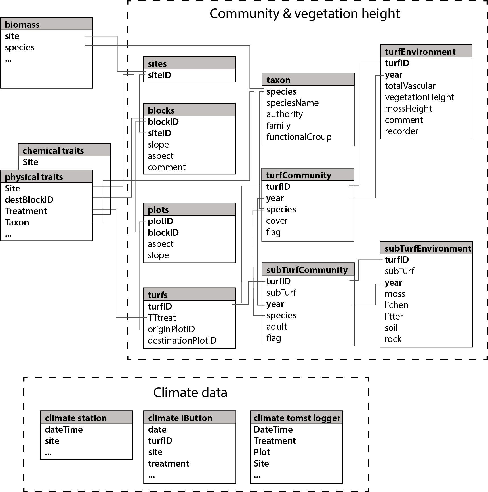

This is the GitHub repository for the SeedClim project. Data paper:
Vandvik et al….

## PROJECT AND SITE INFORMATION

This project reports on…

## DATASETS, CODE AND ANALYSES

The raw and cleaned datasets are stored on OSF…

The data was processed and analysed using R. All code is stored on
github:…

### Download data

To download the data, the following function can be used: …

### Data sets

Describe relationships of the data sets…

Relationship of all data sets.

### SITES

| Variable name                | Variable type | Variable range or levels                                                | How measured | Units/formats/treatment level coding |
| :--------------------------- | :------------ | :---------------------------------------------------------------------- | :----------- | :----------------------------------- |
| siteID                       | categorical   | Alrust - Vikesland                                                      | defined      | Alrust, Vikesland                    |
| norwegianName                | categorical   | NA - NA                                                                 | defined      | Ålrust, Vikesland                    |
| siteCode                     | categorical   | alp1 - low4                                                             | defined      | alp1, sub2, bor4                     |
| latitude                     | numeric       | 60.5445 - 61.0866                                                       | measured     | decimal degree                       |
| longitude                    | numeric       | 5.96487 - 9.07876                                                       | measured     | decimal degree                       |
| x\_UTM33\_North              | numeric       | 7643.94 - 180405                                                        | measured     | UTM                                  |
| y\_UTM33\_north              | numeric       | 6742090 - 6801320                                                       | measured     | UTM                                  |
| altitude(DEM)                | numeric       | 346 - 1213                                                              | measured     | m a.s.l.                             |
| annualPrecipitation\_gridded | numeric       | 596.348 - 3028.69                                                       | measured     | mm                                   |
| temperature\_level           | numeric       | 1 - 3                                                                   | defined      | NA                                   |
| summerTemperature\_gridded   | numeric       | 5.86638 - 10.7775                                                       | measured     | °C                                   |
| precipitation\_level         | numeric       | 1 - 4                                                                   | measured     | NA                                   |
| geology                      | categorical   | Diorittisk til granittisk gneis, migmatitt - Ryolitt, ryodacitt, dacitt | measured     | NA                                   |
| landUse                      | categorical   | NA - NA                                                                 | measured     | NA                                   |

### BLOCK

| Variable name | Variable type | Variable range or levels | How measured | Units/formats/treatment level coding |
| :------------ | :------------ | :----------------------- | :----------- | :----------------------------------- |
| blockID       | categorical   | Alr1 - Vik5              | defined      | Alr1, Vik5                           |
| siteID        | categorical   | Alrust - Vikesland       | defined      | Alrust, Vikesland                    |
| slope         | numeric       | NA - NA                  | measured     | degree                               |
| aspect        | numeric       | NA - NA                  | measured     | degree                               |
| comment       | categorical   | NA - NA                  | NA           | NA                                   |

### PLOT

| Variable name | Variable type | Variable range or levels | How measured | Units/formats/treatment level coding |
| :------------ | :------------ | :----------------------- | :----------- | :----------------------------------- |
| plotID        | numeric       | \-168 - 30610            | defined      | 1, 2, 3                              |
| blockID       | categorical   | Alr1 - Vik5              | defined      | Alr1, Vik5                           |
| aspect        | numeric       | 0 - 0                    | measured     | degree                               |
| slope         | numeric       | 0 - 0                    | measured     | degree                               |

### TURF

| Variable name     | Variable type | Variable range or levels | How measured | Units/formats/treatment level coding |
| :---------------- | :------------ | :----------------------- | :----------- | :----------------------------------- |
| turfID            | categorical   | 1 TT2 28 - Vik5RTG       | defined      | 1 TT2 28 - Vik5RTG                   |
| TTtreat           | categorical   | TT1 - TTC                | defined      | TT1 - TTC                            |
| RTtreat           | categorical   | \- RTS                   | defined      | RTS                                  |
| GRtreat           | categorical   | \- TTC                   | defined      | TTC                                  |
| originPlotID      | numeric       | \-145 - 30610            | defined      | 1, 2, 3                              |
| destinationPlotID | numeric       | \-168 - 30610            | defined      | 1, 2, 3                              |
